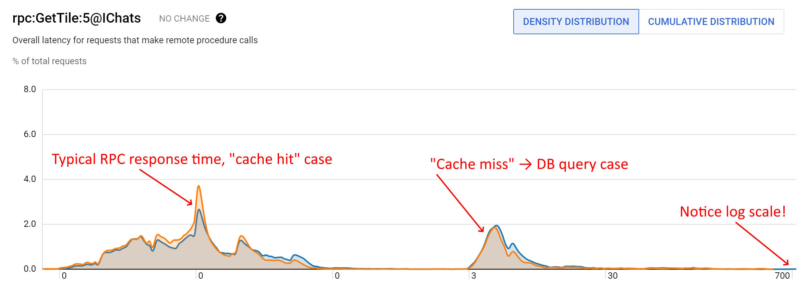

# 👾 Fusion: the "real-time on!" switch that actually exists

[](https://github.com/servicetitan/Stl.Fusion/actions?query=workflow%3A%22Build%22)
[](https://codecov.io/gh/servicetitan/Stl.Fusion)
[](https://www.nuget.org/packages?q=Owner%3Aservicetitan+Tags%3Astl_fusion)
[](https://github.com/servicetitan/Stl.Fusion/blob/master/LICENSE)
<br/>
[](https://discord.gg/EKEwv6d) 

[](https://www.nuget.org/packages?q=Owner%3Aservicetitan+Tags%3Astl_fusion)

Fusion is a .NET library that implements 
 🦄 **D**istributed **REA**ctive **M**emoization (**DREAM**) &ndash; a novel abstraction somewhat similar to MobX or Flux, but **designed to deal with an arbitrary large state** spanning through your backend microservices, intermediate servers (e.g. API servers), and even every client of your app.

Fusion solves a set of infamously hard problems with a single hammer:

| Problem | So you don't need... |
|-|-|
| 📇 Caching | Redis, memcached, ... |
| 🤹 Real-time cache invalidation | No good solutions - <br/>it's an [infamously hard problem](https://martinfowler.com/bliki/TwoHardThings.html) |
| 🚀 Real-time updates | SignalR, WebSockets, gRPC, ... |
| 🤬 Network chattiness | A fair amount of code |
| 🔌 Offline mode support | A fair amount of code |
| 📱 Client-side state management | MobX, Flux/Redux, Recoil, ... |
| 💰 Single codebase for Blazor WebAssembly, Server, and Hybrid/MAUI | No good alternatives |

And the best part is: **Fusion does all of that transparently for you,** so Fusion-based code is almost identical to a code that doesn't involve it. All you need is to:
- "Implement" `IComputeService` (a tagging interface) on your Fusion service to ensure call intercepting proxy is generated for it in compile time.
- Mark methods requiring "Fusion behavior" with `[ComputeMethod]` + declare them as `virtual`
- Register the service via `serviceCollection.AddFusion().AddService<MyService>()`
- Resolve and use them usual - i.e., pass them as dependencies, call their methods, etc.

The magic happens when `[ComputeMethod]`-s are invoked:
1. When Fusion knows that a value for a given call (think `(serviceInstance, method, args...)` cache key) is still consistent, *Fusion returns it instantly, without letting the method to run*.
2. And when the value isn't cached or tagged as inconsistent, *Fusion lets the method run, but captures new value's dependencies in process.* "Dependency" is one `[ComputeMethod]` call triggered during the evaluation of another `[ComputeMethod]` call. 

The second step allows Fusion to track which values are expected to change when one of them changes. It's quite similar to [lot traceability](https://en.wikipedia.org/wiki/Traceability), but implemented for arbitrary functions rather than manufacturing processes.

The last piece of a puzzle is `Computed.Invalidate()` block allowing to tag cached results as "inconsistent with the ground truth". Here is how you use it:
```cs
var avatars = await GetUserAvatars(userId);
using (Computed.Invalidate()) {
    // Any [ComputeMethod] invoked inside this block doesn't run normally,
    // but invalidates the result of the identical call instead.
    // Such calls complete synchronously and return completed Task<TResult>, 
    // so you don't need to await them.

    _ = userService.GetUser(userId);
    foreach (var avatar in avatars)
        _ = userAvatarService.GetAvatar(userId, avatar.Id);
}
```

*The invalidation is always transitive:* if `GetUserProfile(3)` calls `GetUserAvatar("3:ava1")`, and `GetUserAvatar("3:ava1")` gets invalidated, `GetUserProfile(3)` gets invalidated as well.

To make it work, Fusion maintains a dictionary-like structure that tracks recent and "observed" call results:
- Key: `(serviceInstance, method, call arguments...)`
- Value: [Computed<T>], which stores the result, consistency state (`Computing`, `Consistent`, `Invalidated`) and dependent-dependency links. `Computed<T>` instances are nearly immutable: once constructed, they can only transition to `Inconsistent` state.

You can "pull" the `Computed<T>` instance "backing" certain call like this:
```cs
var computed1 = await Computed.Capture(() => GetUserProfile(3));
// You can await await for its invalidation:
await computed1.WhenInvalidated();
Assert.IsFalse(computed1.IsConsistent());
// And recompute it:
var computed2 = await computed1.Recompute();
```

So any `Computed<T>` is *observable*. Moreover, it can be a "replica" of a remote `Computed<T>` instance that mirrors its state in your local process, so *the dependency graph can be distributed*. To make it work, Fusion uses its own WebSocket-based RPC protocol, which is quite similar to any other RPC protocol:
1. To "send" the call to a remote peer, client sends "call" message
2. The peer responds to it with "call result" message. So far there is no difference with any other RPC protocol.
3. **And here is the unique step:** the peer may later send a message telling that the call result it sent earlier was invalidated.
    
*Step 3* doesn't change much in terms of network traffic: it's either zero or one extra message per call (i.e. 3 messages instead of 2 in the worst case). But this small addition allows [Compute Service Clients] to know precisely when a given cached call result becomes inconsistent. 

The presence of *step 3* makes a huge difference: any cached & still consistent result is as good as the data you'll get from the remote server, right?So it's totally fine to resolve a call that "hits" such a result locally, incurring no network round-trip! 

[Compute Service Clients] act as local [Compute Services]. Look at this code:
```cs
string GetUserName(id)
    => (await userService.GetUser(id)).Name;
```

You can't tell whether `userService` here is a local compute service or a compute service client, right?
- Both options are of the same base type (e.g. `IUserService`). The implementations are different though: Fusion service client is registered via `fusion.AddClient<TInterface>()` vs `fusion.AddServer<TInterface, TService>()` for the server.
- And behave identically: 
  - Every call you make to `userService` terminates instantly if its previous result is still consistent
  - And if `GetUserName` is a method of another computed service (a local one), [computed value] backing `GetUser(id)` call that it makes would automatically extend Fusion's dependency graph for `GetUserName(id)` call!

So **Fusion abstracts away the "placement" of a service, and does it much better than a typical RPC proxy:** contrary to conventional RPC proxies, Fusion proxies aren't "chatty".

## Documentation

[](https://alexyakunin.github.io/Stl.Fusion.Materials/Slides/Fusion_v2/Slides.html)
If you prefer slides, check out
["Why real-time web apps need Blazor and Fusion?" talk](https://alexyakunin.github.io/Stl.Fusion.Materials/Slides/Fusion_v2/Slides.html) -
it explains how many problems we tackle are connected, how Fusion addresses the root cause, and how to code a simplified version of Fusion's key abstraction in C#.

> The slides are slightly outdated - e.g. now Fusion clients use `Stl.Rpc` rather than HTTP to communicate with the server, but all the concepts they cover are still intact.

[Quick Start], [Cheat Sheet], and the [Tutorial] are the best places to start from.

Check out [Samples]; some of them are covered further in this document.

## "What is your evidence?"<sup><a href="https://www.youtube.com/watch?v=7O-aNYTtx44<">*</a></sup>

**All of this sounds way too good to believe it really works, right?** That's why there are lots of visual proofs in the remaining part of this document. But if you'll find anything concerning in Fusion's source code or [samples], please feel free to grill us with questions on [Discord]!

Let's start with some big guns:

> Check out [Actual Chat] – a very new chat app built by the minds behind Fusion.
>
> Actual Chat fuses **real-time audio, live transcription, and AI assistance**
> to let you communicate with utmost efficiency.
> With clients for **WebAssembly, iOS, Android, and Windows**, it boasts nearly
> 100% code sharing across these platforms.
> Beyond real-time updates, several of its features, like offline mode,
> are powered by Fusion.
>
> We're posting some code examples from Actual Chat codebase [here](https://actual.chat/chat/san4Cohzym), 
> so join this chat to learn how we use it in a real app.

Now, the samples:

Below is [Fusion+Blazor Sample](https://github.com/servicetitan/Stl.Fusion.Samples#3-blazor-samples)
delivering real-time updates to 3 browser windows:


 Play with 
[live version of this sample](https://fusion-samples.servicetitan.com) right now!

The sample supports [**both** Blazor Server and Blazor WebAssembly 
hosting modes](https://docs.microsoft.com/en-us/aspnet/core/blazor/hosting-models?view=aspnetcore-3.1).
And even if you use different modes in different windows, 
Fusion still keeps in sync literally every bit of a shared state there,
including the sign-in state:


## Is Fusion fast?

**Yes, it's incredibly fast.** Here is an RPC call duration distribution for one of the most frequent calls on [Actual Chat]:



`IChats.GetTile` reads a small "chat tile" - typically 5 entries pinned to a specific ID range, so it can be efficiently cached. And even for these calls the typical response time is barely measurable: every X axis mark is 10x larger than the previous one, so **the highest peak you see is at `0.03ms`!**

The next bump at ~ `4-5ms` is when the service actually goes to the DB - i.e. it's the time you'd expect to see without Fusion. The load would be way higher though, coz *the calls you see on this chart are the calls which "made it" to the server* - in other words, they weren't eliminated by the client / its Fusion services.

[A small synthetic benchmark in Fusion test suite](https://github.com/servicetitan/Stl.Fusion/blob/master/tests/Stl.Fusion.Tests/PerformanceTest.cs) 
compares "raw" [Entity Framework Core](https://docs.microsoft.com/en-us/ef/core/)-based
Data Access Layer (DAL) against its version relying on Fusion:

| Calls/s | PostgreSQL | MariaDB | SQL Server | Sqlite |
|-|-|-|-|-|
| Single reader | 1.02K | 645.77 | 863.33 | 3.79K |
| 960 readers (high concurrency) | 12.96K | 14.52K | 16.66K | 16.50K |
| Single reader + Fusion  | 9.54**M** | 9.28**M** | 9.05**M** | 8.92**M** |
| 960 readers + Fusion | 145.95**M** | 140.29**M** | 137.70**M** | 141.40**M** |

The raw output for this test on Ryzen Threadripper 3960X is [here](./docs/performance-test-results/net8-amd.txt). The number of readers looks crazy at first, but it is tweaked to maximize the output for non-Fusion version of DAL (the readers are asynchronous, so they mostly wait for DB response there).

Fusion's transparent caching ensures every API call result your code produces is cached, and moreover, even when such results are recomputed, they mostly use other cached dependencies instead of hitting a much slower storage (DB in this case).

And interestingly, even when there are no "layers" of dependencies (think only "layer zero" is there), Fusion manages to speed up the API calls this test runs by **8,000 to 12,000** times.

#### What makes Fusion fast:

- The concept itself is all about eliminating any unnecessary computation. Think `msbuild`, but for your method call results: what's computed and consistent is never recomputed.
- Fusion caches call results in memory, so if it's a hit, they're instantly available. No round-trips to external caches, no serialization/deserialization, etc.
- Moreover, there is also no cloning: what's cached is the .NET object or struct returned from a call, so any call result is "shared". It's way more CPU cache-friendly than e.g. deserializing a new copy on any hit.
- Fusion uses its own `Stl.Interception` library to intercept method calls, and although there is no benchmark yet, these are the fastest call interceptors available on .NET - they're marginally faster than e.g. the ones provided by [Castle.DynamicProxy](http://www.castleproject.org/projects/dynamicproxy/). They don't box call arguments and require just 1 allocation per call.
- The same is true about `Stl.Rpc` - a part of Fusion responsible for its RPC calls. Its [preliminary benchmark results](https://servicetitan.github.io/Stl.Fusion.Samples/rpc-benchmark) show it is ~ **1.5x faster than SignalR**, and ~ **3x faster than gRPC**.
- `Stl.Rpc` uses the fastest serializers available on .NET &ndash; [MemoryPack](https://github.com/Cysharp/MemoryPack) by default (it doesn't require runtime IL Emit), though you can also use [MessagePack](https://github.com/MessagePack-CSharp/MessagePack-CSharp) (it's slightly faster, but requires IL Emit) or anything else you prefer.
- All critical execution paths in Fusion are heavily optimized. [Archived version of this page](https://web.archive.org/web/20201212144353/https://github.com/servicetitan/Stl.Fusion) shows the performance on above test currently 3x better than it was 2 years ago.

## Does Fusion scale?

Yes. Fusion does something similar to what any [MMORPG] game engine does: even though the complete game state is huge, it's still possible to 
run the game in real time for 1M+ players, because every player observes a tiny fraction of a complete game state, and thus all you need is to ensure *the observed part* of the state fits in RAM.

And that's exactly what Fusion does:
- It spawns the observed part of the state on-demand (i.e. when you call a [Compute Service] method)
- Ensures the dependency graph backing this part of the state stays in memory while someone uses it
- Destroys what's unobserved.

Check out ["Scaling Fusion Services" part of the Tutorial](https://github.com/servicetitan/Stl.Fusion.Samples/blob/master/docs/tutorial/Part08.md) to see a much more robust description of how Fusion scales.

## Enough talk. Show me the code!

A typical Compute Service looks as follows:

```cs
public class ExampleService : IComputeService
{
    [ComputeMethod]
    public virtual async Task<string> GetValue(string key)
    { 
        // This method reads the data from non-Fusion "sources",
        // so it requires invalidation on write (see SetValue)
        return await File.ReadAllTextAsync(_prefix + key);
    }

    [ComputeMethod]
    public virtual async Task<string> GetPair(string key1, string key2)
    { 
        // This method uses only other [ComputeMethod]-s or static data,
        // thus it doesn't require invalidation on write
        var v1 = await GetNonFusionData(key1);
        var v2 = await GetNonFusionData(key2);
        return $"{v1}, {v2}";
    }

    public async Task SetValue(string key, string value)
    { 
        // This method changes the data read by GetValue and GetPair,
        // but since GetPair uses GetValue, it will be invalidated 
        // automatically once we invalidate GetValue.
        await File.WriteAllTextAsync(_prefix + key, value);
        using (Computed.Invalidate()) {
            // This is how you invalidate what's changed by this method.
            // Call arguments matter: you invalidate only a result of a 
            // call with matching arguments rather than every GetValue 
            // call result!
            _ = GetValue(key);
        }
    }
}
```

`[ComputeMethod]` indicates that every time you call this method,  its result is "backed" by [Computed Value], and thus it captures   dependencies when it runs and instantly returns the result, if the current computed value is still consisntent.

Compute services are registered ~ almost like singletons:
```cs
var services = new ServiceCollection();
var fusion = services.AddFusion(); // It's ok to call it many times
// ~ Like service.AddSingleton<[TService, ]TImplementation>()
fusion.AddService<ExampleService>();
```

Check out [CounterService](https://github.com/servicetitan/Stl.Fusion.Samples/blob/master/src/HelloBlazorServer/Services/CounterService.cs)
from [HelloBlazorServer sample](https://github.com/servicetitan/Stl.Fusion.Samples)
to see the actual code of compute service.

Now, I guess you're curious how the UI code looks like with Fusion You'll be surprised, but it's as simple as it could be:

```cs
// MomentsAgoBadge.razor
@inherits ComputedStateComponent<string>
@inject IFusionTime _fusionTime

<span>@State.Value</span>

@code {
    [Parameter] 
    public DateTime Value { get; set; }

    protected override Task<string> ComputeState()
        => _fusionTime.GetMomentsAgo(Value) ;
}
```

`MomentsAgoBadge` is Blazor component displays 
`"N [seconds/minutes/...] ago"` string. The code above is *almost identical* to its 
[actual code](https://github.com/servicetitan/Stl.Fusion.Samples/blob/master/templates/TodoApp/UI/Shared/MomentsAgoBadge.razor), 
which is a bit more complex due to `null` handling.

You see it uses `IFusionTime` - one of built-in compute services that provides `GetUtcNow` and `GetMomentsAgo` methods. As you might guess,the results of these methods are invalidated automatically; check out [`FusionTime` service](https://github.com/servicetitan/Stl.Fusion/blob/master/src/Stl.Fusion/Extensions/Internal/FusionTime.cs#L46) to see how it works.

But what's important here is that `MomentsAgoBadge` is inherited from 
[ComputedStateComponent<T>](https://github.com/servicetitan/Stl.Fusion/blob/master/src/Stl.Fusion.Blazor/Components/ComputedStateComponent.cs) - 
an abstract type which provides `ComputeState` method. As you might guess, this method behaves like a [Compute Method].

`ComputedStateComponent<T>` exposes `State` property (of `ComputedState<T>` type), 
which allows you to get the most recent output of  `ComputeState()`' via its 
`Value` property. "State" is another key Fusion abstraction - it implements a ["wait for invalidation and recompute" loop 
similar to this one](https://github.com/servicetitan/Stl.Fusion/blob/master/samples/TodoApp/ConsoleClient/Program.cs#L18):
```cs
var computed = await Computed.Capture(_ => service.Method(...));
while (true) {
    await computed.WhenInvalidated();
    computed = await computed.Update();
}
```

The only difference is that it does this in a more robust way - in particular,
it allows you to control the delays between the invalidation and the update, 
access the most recent non-error value, etc.

Finally, `ComputedStateComponent` automatically calls `StateHasChanged()` 
once its `State` gets updated to make sure the new value is displayed.

**So if you use Fusion, you don't need to code any reactions in the UI.**
Reactions (i.e. partial updates and re-renders) happen automatically due
to dependency chains that connect your UI components with the
data providers they use, which in turn are connected to data
providers they use, and so on - till the very basic "ingredient providers",
i.e. compute methods that are invalidated on changes.

If you want to see a few more examples of similarly simple UI components,
check out:
- [Counter.razor](https://github.com/servicetitan/Stl.Fusion.Samples/blob/master/src/HelloBlazorServer/Pages/Counter.razor) - a Blazor component that uses
[CounterService](https://github.com/servicetitan/Stl.Fusion.Samples/blob/master/src/HelloBlazorServer/Services/CounterService.cs)
from [HelloBlazorServer sample](https://github.com/servicetitan/Stl.Fusion.Samples)
- [ChatMessageCountBadge.razor](https://github.com/alexyakunin/BoardGames/blob/main/src/UI/Chat/ChatMessageCountBadge.razor) 
and [AppUserBadge.razor](https://github.com/alexyakunin/BoardGames/blob/main/src/UI/Game/AppUserBadge.razor) from [Board Games].

## Why Fusion is a game changer for real-time apps?

Real-time typically implies you use events to deliver change 
notifications to every client which state might be impacted by
this change, so you have to:

1. *Know which clients to notify about a particular event.* This alone is 
   a fairly hard problem - in particular, you need to know what every client
   "sees" now. Sending events for anything that's out of the "viewport" 
   (e.g. a post you may see, but don't see right now) doesn't make sense,
   because it's a huge waste that severely limits the scalability. 
   Similarly to [MMORPG], the "visible" part of the state is 
   tiny in comparison to the "available" one for most of web apps too.
2. *Apply events to the client-side state.* Kind of an easy problem too,
   but note that you should do the same on server side as well, and
   keeping the logic in two completely different handlers in sync 
   for every event is a source of potential problems in future.
3. *Make UI to properly update its event subscriptions on every
   client-side state change.* This is what client-side code has
   to do to ensure p.1 properly works on server side. And again,
   this looks like a solvable problem on paper, but things get 
   much more complex if you want to ensure your UI provides 
   a truly eventually consistent view. Just think in which order
   you'd run "query the initial data" and "subscribe to the subsequent events"
   actions to see some issues here.
4. *Throttle down the rate of certain events* 
   (e.g. "like" events for every popular post).
   Easy on paper, but more complex if you want to ensure the user sees 
   *eventually consistent view* on your system. 
   In particular, this implies that every event you send "summarizes" 
   the changes made by it and every event you discard, so likely,
   you'll need a dedicated type, producer, and handlers for each of such 
   events.
   
And Fusion solves all these problems using a single abstraction allowing it 
to identifying and track data dependencies automatically. 

## Why Fusion is a game changer for Blazor apps with complex UI?

**Fusion allows you to create truly independent UI components.**
You can embed them in any part of UI without any need
to worry of how they'll interact with each other.

**This makes Fusion a perfect fit for
[micro-frontends](https://martinfowler.com/articles/micro-frontends.html)
on Blazor**: the ability to create loosely coupled UI components 
is paramount there.

Besides that, if your invalidation logic is correct, 
**Fusion guarantees that your UI state is eventually consistent.** 

You might think all of this works only in Blazor Server mode. 
But no, **all these UI components work in Blazor WebAssembly 
mode as well, which is another unique feature Fusion provides.**
Any [Compute Service] can be substituted with [Compute Service Client], which not simply proxies the calls, but also completely 
kills the chattiness you'd expect from a regular client-side proxy.

## Next Steps

* Read [Quick Start], [Cheat Sheet], or the whole [Tutorial]
* Check out [Samples]
* Join our [Discord Server] to ask questions and track project updates. *If you're curious, "why Discord," the server was created long before the first line of [Actual Chat]'s code was written. However, a Fusion-powered alternative will be available quite soon :)*

## Posts And Other Content
* [Fusion: 1st birthday, 1K+ stars on GitHub, System.Text.Json support in v1.4](https://alexyakunin.medium.com/fusion-1st-birthday-1k-stars-on-github-system-text-json-support-in-v1-4-c73e9feb45c7?source=friends_link&sk=2e261e0dacce92f05d31baac400c3032)
* [Popular UI architectures compared & how Blazor+Fusion UI fits in there](https://itnext.io/the-most-popular-ui-architectures-and-how-fusion-based-ui-fits-in-there-fb47e45038a7?source=friends_link&sk=bef676ccd1f3c6e6148178bf05346852)
* [Fusion: Current State and Upcoming Features](https://alexyakunin.medium.com/fusion-current-state-and-upcoming-features-88bc4201594b?source=friends_link&sk=375290c4538167fe99419a744f3d42d5)
* [The Ungreen Web: Why our web apps are terribly inefficient?](https://alexyakunin.medium.com/the-ungreen-web-why-our-web-apps-are-terribly-inefficient-28791ed48035?source=friends_link&sk=74fb46086ca13ff4fea387d6245cb52b)
* [Why real-time UI is inevitable future for web apps?](https://medium.com/@alexyakunin/features-of-the-future-web-apps-part-1-e32cf4e4e4f4?source=friends_link&sk=65dacdbf670ef9b5d961c4c666e223e2)
* [How similar is Fusion to SignalR?](https://medium.com/@alexyakunin/how-similar-is-stl-fusion-to-signalr-e751c14b70c3?source=friends_link&sk=241d5293494e352f3db338d93c352249)
* [How similar is Fusion to Knockout / MobX?](https://medium.com/@alexyakunin/how-similar-is-stl-fusion-to-knockout-mobx-fcebd0bef5d5?source=friends_link&sk=a808f7c46c4d5613605f8ada732e790e)
* [Fusion In Simple Terms](https://medium.com/@alexyakunin/stl-fusion-in-simple-terms-65b1975967ab?source=friends_link&sk=04e73e75a52768cf7c3330744a9b1e38)


**P.S.** If you've already spent some time learning about Fusion, 
please help us to make it better by completing [Fusion Feedback Form] 
(1&hellip;3 min).

[Compute Services]: https://github.com/servicetitan/Stl.Fusion.Samples/blob/master/docs/tutorial/Part01.md
[Compute Service]: https://github.com/servicetitan/Stl.Fusion.Samples/blob/master/docs/tutorial/Part01.md
[`Computed<T>`]: https://github.com/servicetitan/Stl.Fusion.Samples/blob/master/docs/tutorial/Part02.md
[Computed Value]: https://github.com/servicetitan/Stl.Fusion.Samples/blob/master/docs/tutorial/Part02.md
[Computed Values]: https://github.com/servicetitan/Stl.Fusion.Samples/blob/master/docs/tutorial/Part02.md
[Compute Service Clients]: https://github.com/servicetitan/Stl.Fusion.Samples/blob/master/docs/tutorial/Part04.md
[Compute Service Client]: https://github.com/servicetitan/Stl.Fusion.Samples/blob/master/docs/tutorial/Part04.md
[Replica Services]: https://github.com/servicetitan/Stl.Fusion.Samples/blob/master/docs/tutorial/Part04.md
[Replica Service]: https://github.com/servicetitan/Stl.Fusion.Samples/blob/master/docs/tutorial/Part04.md
[State]: https://github.com/servicetitan/Stl.Fusion.Samples/blob/master/docs/tutorial/Part03.md

[Overview]: docs/Overview.md
[Documentation Home]: docs/README.md
[Fusion Samples]: https://github.com/servicetitan/Stl.Fusion.Samples
[Samples]: https://github.com/servicetitan/Stl.Fusion.Samples
[Board Games]: https://github.com/alexyakunin/BoardGames
[Tutorial]: https://github.com/servicetitan/Stl.Fusion.Samples/blob/master/docs/tutorial/README.md
[Quick Start]: https://github.com/servicetitan/Stl.Fusion.Samples/blob/master/docs/tutorial/QuickStart.md
[Cheat Sheet]: https://github.com/servicetitan/Stl.Fusion.Samples/blob/master/docs/tutorial/Fusion-Cheat-Sheet.md
[Slides]: https://alexyakunin.github.io/Stl.Fusion.Materials/Slides/Fusion_v2/Slides.html
[MMORPG]: https://en.wikipedia.org/wiki/Massively_multiplayer_online_role-playing_game
[Actual Chat]: https://actual.chat

[Discord]: https://discord.gg/EKEwv6d
[Discord Server]: https://discord.gg/EKEwv6d
[Fusion Feedback Form]: https://forms.gle/TpGkmTZttukhDMRB6
