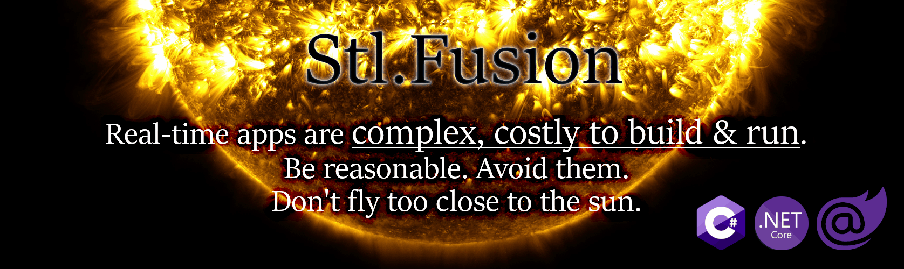
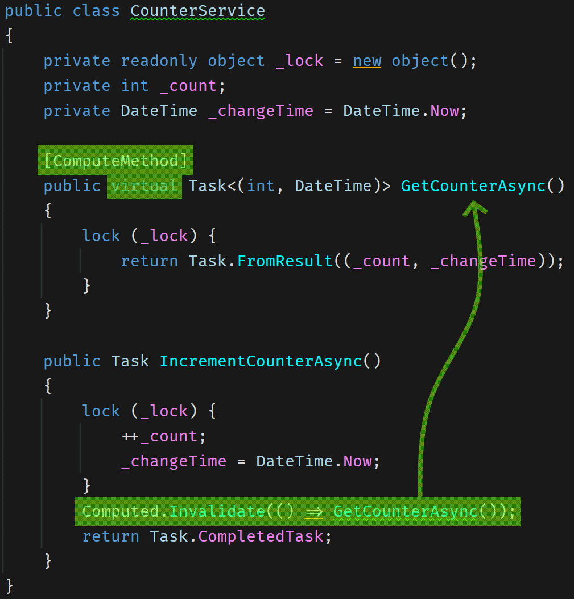
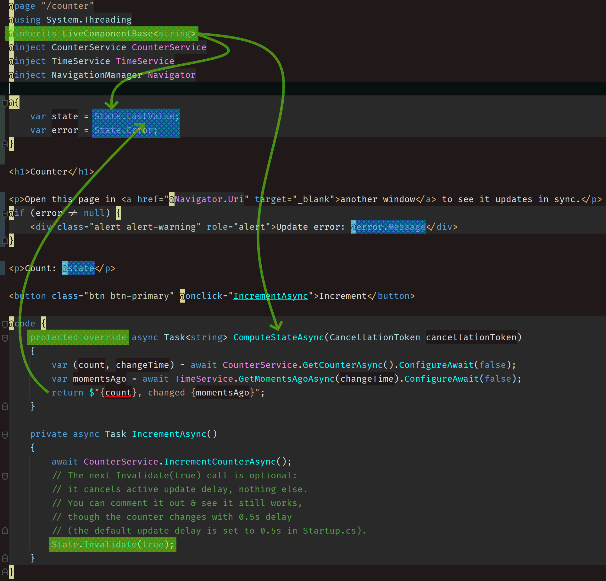
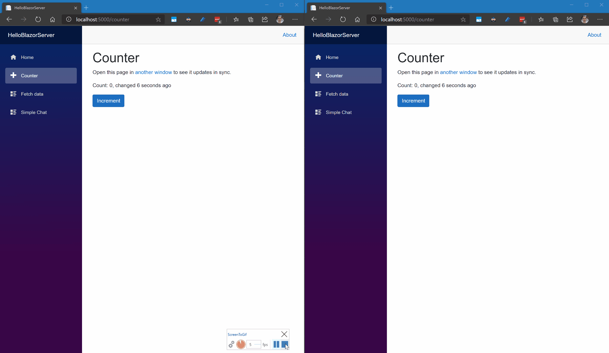
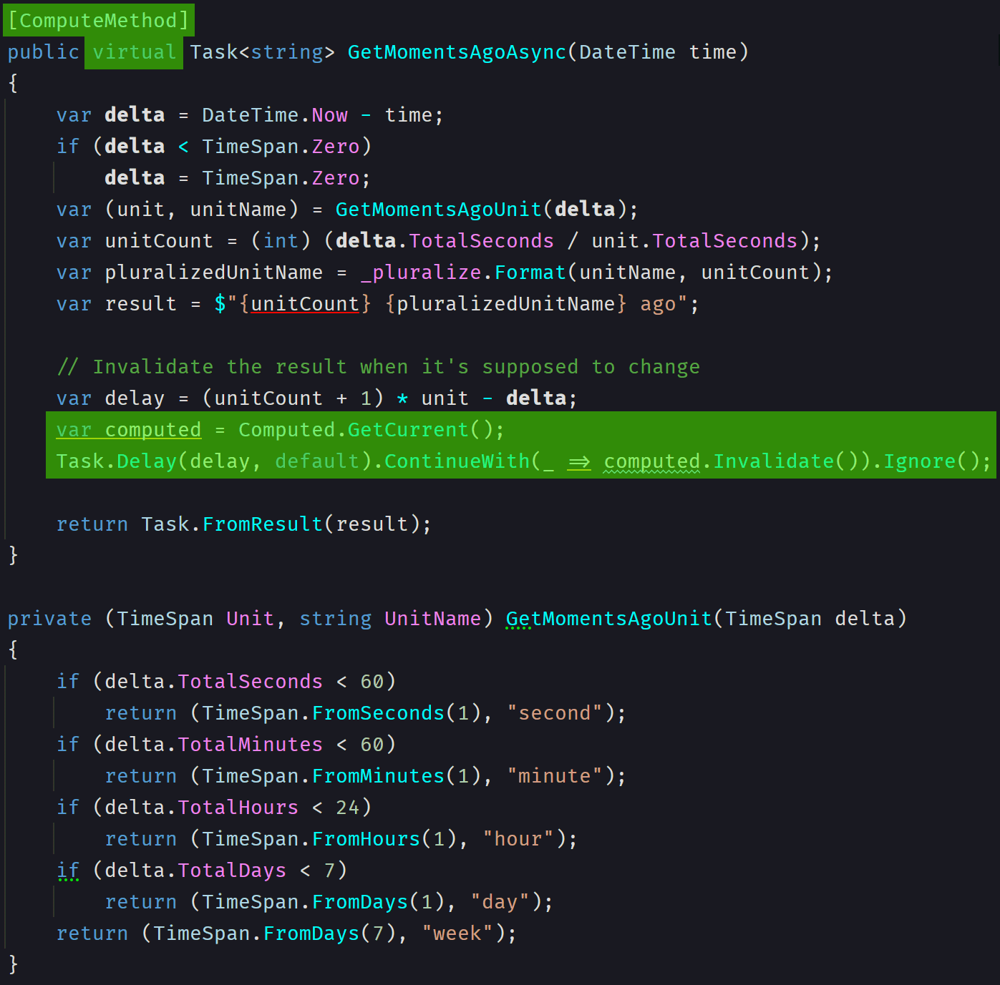
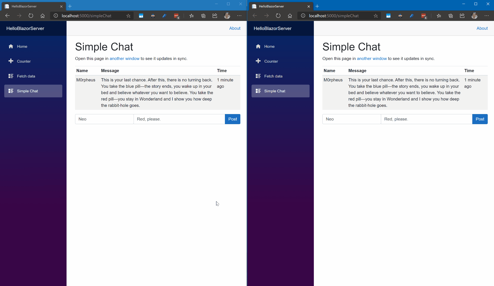
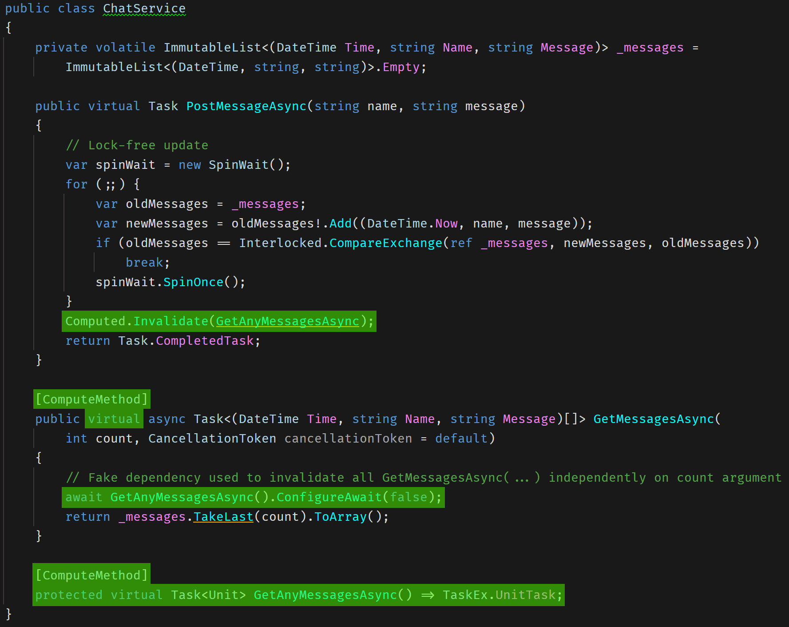

> All project updates are published on its [Discord Server]; it's also the best place for Q/A.\
> 
> 
> 

## What is Fusion?

  

Fusion is a [.NET Core](https://en.wikipedia.org/wiki/.NET_Core) library
providing a new change tracking abstraction built in assumption that **every piece of data 
you have is a part of the observable state / model**, and since there is 
no way to fit such a huge state in RAM, Fusion:
* Spawns the **observed part** of this state on-demand
* **Holds the dependency graph of any observed state in memory** to make sure 
  every dependency of this state triggers cascading invalidation once it gets 
  changed.
* And finally, **it does all of this automatically and transparently for you**, 
  so Fusion-based code is [almost identical](#enough-talk-show-me-the-code)
  to the code you'd write without it.

This is quite similar to what any [MMORPG] game engine does: 
even though the complete game state is huge, it's still possible to 
run the game in real time for 1M+ players, because every player observes 
a tiny fraction of a complete game state, and thus all you need is to ensure
this part of the state fits in RAM + you have enough computing power 
to process state changes for every player.

Under the hood, Fusion turns any response of your internal and public API 
into ~ `(Result<T> Response, Task Invalidated)` pair, where the second part tells 
when this pair has to be recomputed. But you rarely need to deal with this &ndash;
Fusion-based services return regular result types, and these pairs
(actually, [`IComputed<T>`] instances) are created, consumed, and composed into
complex dependency graphs transparently for you.

### Build a Real-Time UI

This is [Fusion+Blazor Sample](https://github.com/servicetitan/Stl.Fusion.Samples#3-blazor-samples),
delivering real-time updates to 3 browser windows:

The sample supports **both (!)** Server-Side Blazor and Blazor WebAssembly 
[hosting modes](https://docs.microsoft.com/en-us/aspnet/core/blazor/hosting-models?view=aspnetcore-3.1)
&ndash; you can switch the mode on its "Home" page.

Check out ["Why real-time UI is inevitable future for web apps?"](https://medium.com/@alexyakunin/features-of-the-future-web-apps-part-1-e32cf4e4e4f4?source=friends_link&sk=65dacdbf670ef9b5d961c4c666e223e2) to learn why "Refresh" action is getting obsolete.

### Speedup Your Service By Caching Everything

[A small benchmark in Fusion test suite](https://github.com/servicetitan/Stl.Fusion/blob/master/tests/Stl.Fusion.Tests/PerformanceTest.cs) 
compares "raw" [Entity Framework Core](https://docs.microsoft.com/en-us/ef/core/) - 
based Data Access Layer (DAL) against its version relying on Fusion. 
Both tests run *almost* identical code - in fact, the only difference is that Fusion
version of this test uses Fusion-provided proxy wrapping the 
[`UserService`](https://github.com/servicetitan/Stl.Fusion/blob/master/tests/Stl.Fusion.Tests/Services/UserService.cs)
(the DAL used in this test) instead of the actual type.

The performance difference looks shocking at first:

The speedup is:
* ~31,500x for [Sqlite EF Core Provider](https://www.sqlite.org/index.html) 
* ~1,000x for [In-memory EF Core Provider](https://docs.microsoft.com/en-us/ef/core/providers/in-memory/?tabs=dotnet-core-cli)  

Such a speedup is possible because Fusion ensures that every output 
Fusion service produces or consumes &ndash; even the intermediate one &ndash;
**is computed just once** and **reused without recomputation** while it stays
consistent with the ground truth.

In other words, Fusion acts as a **transparent cache + incremental build system** 
for any computation your code runs, and as you can see, it's fast enough to be
able to speed up even a code relying on in-memory EF Core provider by 1000x!

Note that:
* Similarly to real-time updates, *you get this speedup for free* in terms of extra code.
* You also get *almost always consistent* cache. 
  It's still an *eventually consistent* cache, of course, but the inconsistency periods 
  for cache entries are so short that normally don't need to worry about the inconsistencies.
* The speedup you're expected to see in production may differ from these numbers a lot. 
  Even though the results presented here are absolutely real, they are produced on a synthetic test.

Check out ["The Ungreen Web: Why our web apps are terribly inefficient?"](https://alexyakunin.medium.com/the-ungreen-web-why-our-web-apps-are-terribly-inefficient-28791ed48035?source=friends_link&sk=74fb46086ca13ff4fea387d6245cb52b) to learn more about the benefits of this.

## How Fusion works?

Fusion provides three key abstractions:
* [Compute Services] are services exposing methods "backed" by Fusion's 
  version of "computed observables". Compute Services are responsible for 
  "spawning" parts of the state on-demand.
* [Replica Services] - remote proxies of Compute Services.
  They allow remote clients to consume ("observe") the parts of server-side state.
  They typically "substitute" similar [Compute Services] on the client side.
* And finally, [`IComputed<T>`] &ndash; an observable [Computed Value]
  that's in some ways similar to the one you can find in Knockout, MobX, or Vue.js,
  but very different, if you look at its fundamental properties.
    
[`IComputed<T>`] is:
* **Thread-safe**
* **Asynchronous** &ndash; any [Computed Value] is computed asynchronously; 
  Fusion APIs dependent on this feature are also asynchronous.
* **Almost immutable** &ndash; once created, the only change that may happen to it is transition 
  to `IsConsistent() == false` state
* **GC-friendly** &ndash; if you know about 
  [Pure Computed Observables](https://knockoutjs.com/documentation/computed-pure.html) 
  from Knockout, you understand the problem. [`IComputed<T>`] solves it even better &ndash;
  dependent-dependency relationships are explicit there, and the reference pointing
  from dependency to dependent is [weak](https://en.wikipedia.org/wiki/Weak_reference), 
  so any dependent [Computed Value] is available for GC unless it's referenced by something 
  else (i.e. used).

All above make it possible to use [`IComputed<T>`] on the server side &ndash; 
you don't have to synchronize access to it, you can use it everywhere, including
async functions, and you don't need to worry about GC.

But there is more &ndash; any [Computed Value]:

* **Is computed just once** &ndash; when you request the same Computed Value at the same time 
  from multiple (async) threads and it's not cached yet, just one of these threads will
  actually run the computation.  Every other async thread will await till its completion 
  and return the newly cached instance.
* **Updated on demand** &ndash; once you have an [`IComputed<T>`], you can ask for its
  consistent version at any time. If the current version is consistent, you'll get the 
  same object, otherwise you'll get a *newly computed* consistent version, 
  and every other version of it  is guaranteed to be marked inconsistent.
  At glance, it doesn't look like a useful property, but together with immutability and
  "computed just once" model, it de-couples invalidations (change notifications) 
  from updates, so ultimately, you are free to decide for how long to delay the 
  update once you know certain state is inconsistent.
* **Supports remote replicas** &ndash; any Computed Value instance can be *published*, 
  which allows any other code that knows the publication endpoint and publication ID 
  to create a replica of this [`IComputed<T>`] instance in their own process. 
  [Replica Services] mentioned above rely on this feature.

### Why these features are game changing?

Real-time typically implies you need one or another flavor of
[*event-driven architecture*](https://martinfowler.com/articles/201701-event-driven.html)
(CQRS, event sourcing, actors, etc.). And all these options are more complex than
a simple and familiar *request-response model*, which Fusion allows you to use.

Besides that, Fusion solves a complex problem of identifying and tracking dependencies 
automatically for any method that uses Fusion-based services (+ its own logic) 
to produce the output, and implementing this without Fusion is not only hard,
but quite error prone problem.

Of course you still can use events, event sourcing, CQRS, etc. - 
you'll just need maybe 100&times; fewer event types.

Check out [how Fusion differs from SignalR](https://medium.com/@alexyakunin/ow-similar-is-stl-fusion-to-signalr-e751c14b70c3?source=friends_link&sk=241d5293494e352f3db338d93c352249)
&ndash; this post takes a real app example (Slack-like chat) and describes
what has to be done in both these cases to implement it.

### Does Fusion scale?

Yes. [MMORPG] example provided earlier hints on how Fusion-based apps scale. 
But contrary to games, web apps rarely have a strong upper limit on update delay
&ndash; at least for a majority of content they present. 
This means you can always increase these delays to throttle down the rate of 
outgoing invalidation and update messages, and vice versa.
In other words, Fusion-based web apps should scale much better than MMORPG.

## Enough talk. Show me the code!

[Compute Services] is where a majority of Fusion-based code is supposed to live.
[CounterService](https://github.com/servicetitan/Stl.Fusion.Samples/blob/master/src/HelloBlazorServer/Services/CounterService.cs)
from [HelloBlazorServer sample](https://github.com/servicetitan/Stl.Fusion.Samples)
is a good example of such a service:

Lime-colored parts show additions to a similar singleton service
you'd probably have in case when real-time updates aren't needed:
* `[ComputeMethod]` indicates that any `GetCounterAsync` result should be 
  "backed" by [Computed Value]. 
  This attribute works only when you register a service as [Compute Service] 
  in IoC container and the method it is applied to is virtual.
* `Computed.Invalidate` call finds a [Computed Value] "backing" the most recent
  `GetCounterAsync` call with the same arguments (no arguments in this case) 
  and invalidates it - unless it doesn't exist or was invalidated earlier.
  We have to manually invalidate this value because `GetCounterAsync`
  doesn't call any other [Compute Services], and thus its result doesn't
  have any dependencies which otherwise would auto-invalidate it.

[Counter.razor](https://github.com/servicetitan/Stl.Fusion.Samples/blob/master/src/HelloBlazorServer/Pages/Counter.razor) is a Blazor Component that uses
`CounterService`:

Again, lime-colored parts show additions to a similar Blazor Component without 
real-time updates:
* It inherits from [LiveComponentBase<T>](https://github.com/servicetitan/Stl.Fusion/blob/master/src/Stl.Fusion.Blazor/LiveComponentBase.cs) - a small wrapper over
  `ComponentBase` (base class for any Blazor component), which adds
  `State` property and abstract `ComputeStateAsync` method allowing to
  (re)compute the `State.Value` once any of its dependencies changes.
* `LiveComponent<T>.State` property is a [Live State] - an object exposing 
  the most current [Computed Value] produced by a computation (`Func<...>`)
  and making sure it gets recomputed with a controllable delay 
  after any of its dependencies change.
* As you might guess, `ComputeStateAsync` defines `State.Value` computation logic
  in any `LiveComponentBase<T>` descendant.

Blue-colored parts show how `State` is used:
* `State.LastValue` is the most recent non-error value produced by the computation.
  It's a "safe pair" to `State.Value` (true most recent computation result), 
  which throws an error if `State.Error != null`.
* `State.Error` contains an exception thrown by `ComputeStateAsync` when it fails,
  otherwise `null`.

That's *almost literally* (minus IoC registration) all you need to have this:

And if you're curious how "X seconds ago" gets updated,
notice that `ComputeStateAsync` invokes `TimeService.GetMomentsAgoAsync`,
which looks as follows:

In other words, `ComputeStateAsync` becomes dependent on "moments ago"
value, and this value self-invalidates ~ at the right moment triggering 
cascading `ComputeStateAsync` invalidation.

"Simple Chat" is a bit more complex example showing another interesting
aspect of this approach:
> Since *any event* describes *a change*, Fusion's only "invalidated" event 
> ("the output of f(...) changed") allows you to implement a reaction to 
> *nearly any* change without a need for a special event!

"Simple Chat" features a chat bot that listens to new chat messages and
responds to them:

`ChatService` source code doesn't have any special logic to support chat bots - 
similarly to `CounterService`, it's almost the same as a similar service that
doesn't support any kind of real-time behavior at all:

But since `ChatService` is a [Compute Service], you can implement a "listener" 
reacting to changes in `GetMessagesAsync` output relying on e.g. [Live State] - 
and 
[that's exactly what `ChatBotService` does](https://github.com/servicetitan/Stl.Fusion.Samples/blob/master/src/HelloBlazorServer/Services/ChatBotService.cs).

## Next Steps

* Check out [Tutorial], [Samples], or go to [Documentation Home]
* Join our [Discord Server] or [Gitter] to ask questions and track project updates.

## Posts And Other Content
* [The Ungreen Web: Why our web apps are terribly inefficient?](https://alexyakunin.medium.com/the-ungreen-web-why-our-web-apps-are-terribly-inefficient-28791ed48035?source=friends_link&sk=74fb46086ca13ff4fea387d6245cb52b)
* [Why real-time UI is inevitable future for web apps?](https://medium.com/@alexyakunin/features-of-the-future-web-apps-part-1-e32cf4e4e4f4?source=friends_link&sk=65dacdbf670ef9b5d961c4c666e223e2)
* [How similar is Fusion to SignalR?](https://medium.com/@alexyakunin/how-similar-is-stl-fusion-to-signalr-e751c14b70c3?source=friends_link&sk=241d5293494e352f3db338d93c352249)
* [How similar is Fusion to Knockout / MobX?](https://medium.com/@alexyakunin/how-similar-is-stl-fusion-to-knockout-mobx-fcebd0bef5d5?source=friends_link&sk=a808f7c46c4d5613605f8ada732e790e)
* [Fusion In Simple Terms](https://medium.com/@alexyakunin/stl-fusion-in-simple-terms-65b1975967ab?source=friends_link&sk=04e73e75a52768cf7c3330744a9b1e38)

**P.S.** If you've already spent some time learning about Fusion, 
please help us to make it better by completing [Fusion Feedback Form] 
(1&hellip;3 min).

[Compute Services]: https://github.com/servicetitan/Stl.Fusion.Samples/blob/master/docs/tutorial/Part01.md
[Compute Service]: https://github.com/servicetitan/Stl.Fusion.Samples/blob/master/docs/tutorial/Part01.md
[`IComputed<T>`]: https://github.com/servicetitan/Stl.Fusion.Samples/blob/master/docs/tutorial/Part02.md
[Computed Value]: https://github.com/servicetitan/Stl.Fusion.Samples/blob/master/docs/tutorial/Part02.md
[Live State]: https://github.com/servicetitan/Stl.Fusion.Samples/blob/master/docs/tutorial/Part03.md
[Replica Services]: https://github.com/servicetitan/Stl.Fusion.Samples/blob/master/docs/tutorial/Part04.md
[Overview]: docs/Overview.md
[Documentation Home]: docs/README.md
[Samples]: https://github.com/servicetitan/Stl.Fusion.Samples
[Tutorial]: https://github.com/servicetitan/Stl.Fusion.Samples/blob/master/docs/tutorial/README.md
[MMORPG]: https://en.wikipedia.org/wiki/Massively_multiplayer_online_role-playing_game

[Gitter]: https://gitter.im/Stl-Fusion/community
[Discord Server]: https://discord.gg/EKEwv6d
[Fusion Feedback Form]: https://forms.gle/TpGkmTZttukhDMRB6
