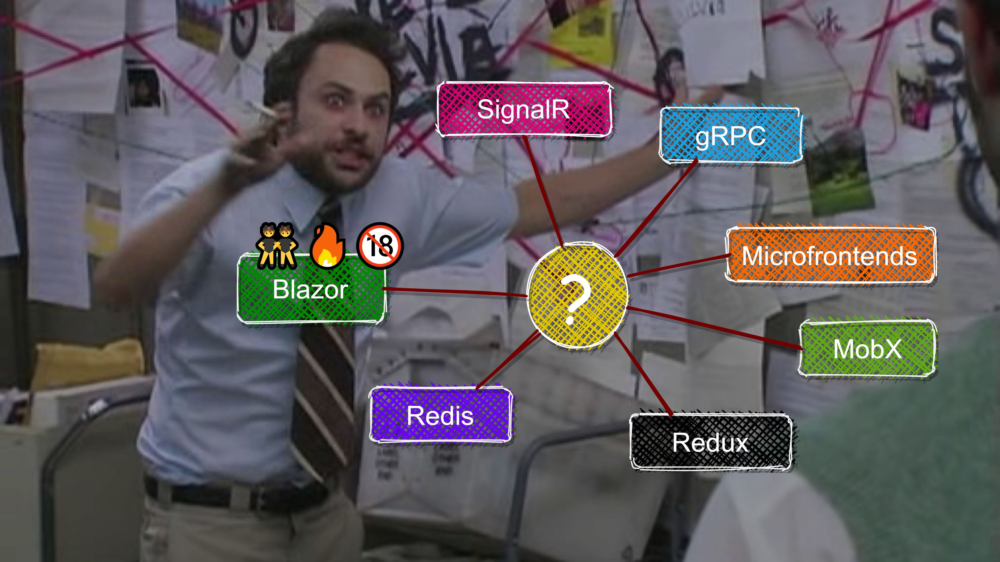
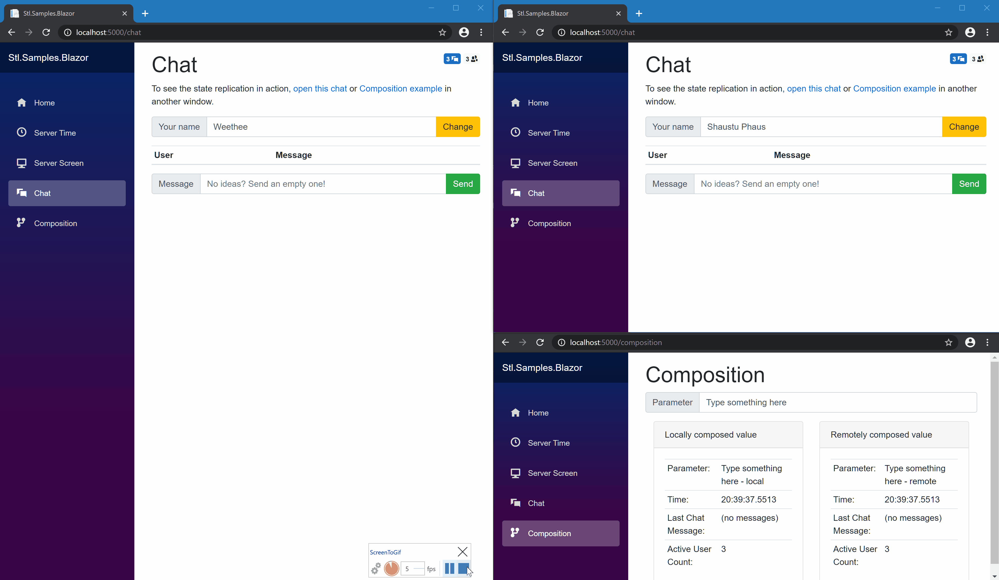
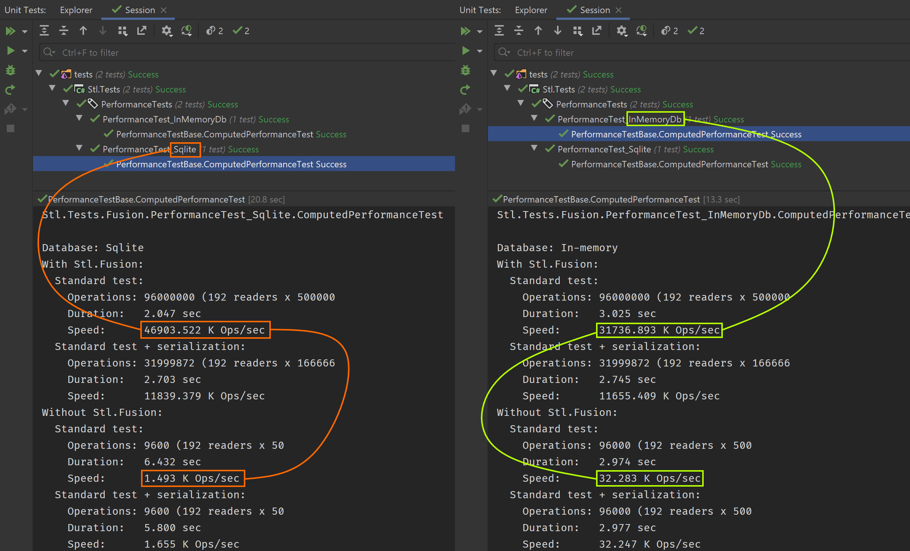

# 🌞 Fusion: the "alien 🛸 engine" for real-time .NET & Blazor apps

[](https://github.com/servicetitan/Stl.Fusion/actions?query=workflow%3A%22Build%22)
[](https://codecov.io/gh/servicetitan/Stl.Fusion)
[](https://www.nuget.org/packages?q=Owner%3Aservicetitan+Tags%3Astl_fusion)
[](https://github.com/servicetitan/Stl.Fusion/blob/master/LICENSE)
<br/>
[](https://discord.gg/EKEwv6d) 

[](https://www.nuget.org/packages?q=Owner%3Aservicetitan+Tags%3Astl_fusion)

Fusion is a .NET library that implements 
**D**istributed **REA**ctive **M**emoization (**DREAM**) &ndash; 
a novel technique that gracefully solves a number of well-known problems:

| Problem | So you don't need... |
|-|-|
| 📱 Client-side state management | Fluxor, Redux, MobX, Recoil, ... |
| 🚀 Real-time updates | SignalR, WebSockets, gRPC streaming, ... |
| 📇 In-memory cache | Redis, memcached, ... |
| 🤹 Real-time cache invalidation | No good solutions - <br/>it's an [infamously hard problem](https://martinfowler.com/bliki/TwoHardThings.html) |
| 📪 Automatic & transparent pub/sub | A fair amount of code |
| 🤬 Network chattiness | A fair amount of code |
| 💰 Single codebase for Blazor WebAssembly, Server, and Hybrid | No good alternatives |

So what DREAM means?
- **[Memoization](https://en.wikipedia.org/wiki/Memoization)** is a technique used
  to speed up function calls by caching the output for a given input. Fusion
  provides a *transparent memoization* for any function you like, so
  when you call `GetUser(id)` multiple times, its actual computation
  happens just once for every `id` assuming there is enough RAM to cache every result.
- **[Reactive](https://en.wikipedia.org/wiki/Reactive_programming)** 
  part of your Fusion-based code reacts to changes by triggering 
  *invalidations*. Invalidation is a call to memoizing function inside
  special `using (Computed.Invalidate()) { ... }` block, which
  marks the cached result for this specific call (e.g. `GetUser(3)`) 
  and every other result that depends on it (e.g. `GetUserPic(3)`, which
  calls `GetUser(3)`) directly or indirectly as *inconsistent with the ground truth*
  to ensure they'll be recomputed on the next *actual* (non-invalidating) call.
  This also means Fusion tracks dependencies between the computation results;
  the dependency graph is updated in the runtime, and this process is 
  completely transparent for the developers.
- These computation graphs can be 
  **[Distributed](https://en.wikipedia.org/wiki/Distributed_computing)**:
  Fusion allows you to create *invalidation-aware caching RPC clients* 
  for any of such functions. They:
  - Eliminate network chattiness by re-using locally cached results while
    it's known they aren't invalidated on the server side yet.
    The pub/sub, delivery, and processing of invalidation messages 
    happens automatically and transparently for you.
  - Moreover, such clients register their results in Fusion's dependency graph
    like any other Fusion functions, so if you client-side code declares 
    `GetUserProfileUI(id) => renderUserProfile(server.GetUser(id))` function, 
    `GetUserName(id)` result will be invalidated once `GetUser(id)`
    gets invalidated on the server side. That's what makes
    pieces of UI to update on the client side in real-time.
  
> [Lot traceability](https://en.wikipedia.org/wiki/Traceability) is probably the 
> best real-world analogy of how this approach works:
> - For every "product" 🥗 ([computed value]), Fusion keeps track of
>   its "recipe" 📝 (function and its arguments), but more importantly, 
>   all of its "ingredients" 🥬🥦🍅, i.e. intermediate or "basic" products
>   used to produce it.<br/>
>   E.g. 🥗<sub>v1</sub> = `📝salad("weird_mix")` + 
>   (🥬<sub>v1</sub> 🥦<sub>v1</sub> 🍅<sub>v1</sub>)
> - While all the "ingredients" used to produce 🥗<sub>v1</sub> are "valid", Fusion 
>   ensures that calling a recipe `📝salad("weird_mix")`
>   resolves to the same cached product instance 🥗<sub>v1</sub>
> - But once one of such ingredients 🍅<sub>v1</sub> gets "contaminated" 
>   ("invalidated" in Fusion terms, i.e. marked as changed),
>   Fusion immediately marks everything that uses this product
>   directly or indirectly as "contaminated" as well, including 🥗<sub>v1</sub>
> - So next time you call `📝salad("weird_mix")`, it will produce a new
>   🥗<sub>v2</sub> = `📝salad("weird_mix")` + 
>   (🥬<sub>v1</sub> 🥦<sub>v1</sub> 🍅<sub>v2</sub>)
> 
> Lot traceability allows to identify every product that uses certain ingredient,
> and consequently, even every buyer of a product that has certain ingredient. 
> So if you want every consumer to have the most up-to-date version of every product 
> they bought &ndash; the most up-to-date 🚗, 🤳, or 👠 &ndash; 
> lot traceability makes this possible.
> And assuming every purchase order triggers the whole build chain and uses
> the most recent ingredients, merely notifying the consumers they can buy 
> a newer version of 📱 is enough. It's up to them to decide when to update -
> they can do this immediately or postpone this till the next 💰, but
> the important piece is: they are aware the product they have is obsolete now.

We know all of this sounds weird. That's why there are lots of
visual proofs in the remaining part of this document.
But if you'll find anything concerning in Fusion's source code 
or [samples], please feel free to grill us with questions on [Discord]!

[](https://alexyakunin.github.io/Stl.Fusion.Materials/Slides/Fusion_v2/Slides.html)
If you prefer slides and 🕵 detective stories, check out
["Jump the F5 ship straight into the real-time hyperspace with Blazor and Fusion" talk](https://alexyakunin.github.io/Stl.Fusion.Materials/Slides/Fusion_v2/Slides.html) -
it explains how all these problems are connected and
describes how you can code a simplified version of 
Fusion's key abstraction in C#. 

And if you prefer text - just continue reading!

## "What is your evidence?"<sup><a href="https://www.youtube.com/watch?v=7O-aNYTtx44<">*</a></sup>

This is [Fusion+Blazor Sample](https://github.com/servicetitan/Stl.Fusion.Samples#3-blazor-samples)
delivering real-time updates to 3 browser windows:



 Play with [live version of this sample](https://fusion-samples.servicetitan.com) right now!

The sample supports [**both** Blazor Server and Blazor WebAssembly 
hosting modes](https://docs.microsoft.com/en-us/aspnet/core/blazor/hosting-models?view=aspnetcore-3.1).
And even if you use different modes in different windows, 
Fusion still keeps in sync literally every piece of shared state there,
including sign-in state:


 If you're looking for more complex example, check out [Board Games] - it's the newest Fusion sample that runs on 3-node GKS cluster and implements 2 games, chat, online presence, OAuth sign-in, user session tracking and a number of other 100% real-time features. All of this is powered by Fusion + **just 35 lines of code related to real-time updates!**

[A small benchmark in Fusion test suite](https://github.com/servicetitan/Stl.Fusion/blob/master/tests/Stl.Fusion.Tests/PerformanceTest.cs) 
compares "raw" [Entity Framework Core](https://docs.microsoft.com/en-us/ef/core/)-based
Data Access Layer (DAL) against its version relying on Fusion:



The speedup you see is:
* ~31,500x for [Sqlite EF Core Provider](https://www.sqlite.org/index.html)
* ~1,000x for [In-memory EF Core Provider](https://docs.microsoft.com/en-us/ef/core/providers/in-memory/?tabs=dotnet-core-cli)
* These numbers are 
  [slightly smaller](https://alexyakunin.github.io/Stl.Fusion.Materials/Slides/Fusion_v2/Slides.html#109) 
  on the most recent Fusion version, but the difference is still huge.

Fusion's transparent caching ensures every computation your code runs
re-uses as many of cached dependencies as possible & caches its own output.
As you can see, this feature allows to speed up even a very basic logic 
(fetching a single random user) using **in-memory** EF Core provider by **1000x**,
and the more complex logic you have, the larger performance gain is.

## How Fusion works?

There are 4 components:
1. [Compute Services] are services exposing methods "backed" by Fusion's 
  version of "computed observables". When such methods run, they produce
  [Computed Values] (instances of `IComputed<T>`) under the hood, even
  though the results they return are usual (i.e. are of their return type). 
  But `IComputed<T>` instances are cached and reused on future calls to 
  the same method with the same arguments; moreover, they form dependency graphs, 
  so once some "deep" `IComputed<T>` gets invalidated, all of its dependencies
  are invalidated too.
2. [Replica Services] are remote proxies of Compute Services.
  They substitute [Compute Services] they "replicate" on the client side
  exposing their interface, but more importantly, they also "connect" 
  `IComputed<T>` instances they create on the client with their server-side 
  counterparts.
  Any Replica Service is also a Compute Service, so any other client-side 
  Compute Service method that calls it becomes dependent on its output too.
  And since any Compute Service never runs the same computation twice
  (unless it is invalidated), they kill any network chattiness.
3. `IState<T>` - more specifically, `IComputedState<T>` and `IMutableState<T>`.
  States are quite similar to observables in Knockout or MobX, but
  designed to follow Fusion game rules. And yes, you mostly use them in UI and
  almost never - on the server-side.
4. And finally, there is [`IComputed<T>`] &ndash; an observable [Computed Value]
  that's in some ways similar to the one you can find in Knockout, MobX, or Vue.js,
  but very different, if you look at its fundamental properties.
    
[`IComputed<T>`] is:
* **Thread-safe**
* **Asynchronous** &ndash; any [Computed Value] is computed asynchronously; 
  Fusion APIs dependent on this feature are also asynchronous.
* **Almost immutable** &ndash; once created, the only change that may happen to it is transition 
  to `IsConsistent() == false` state
* **GC-friendly** &ndash; if you know about 
  [Pure Computed Observables](https://knockoutjs.com/documentation/computed-pure.html) 
  from Knockout, you understand the problem. [`IComputed<T>`] solves it even better &ndash;
  dependent-dependency relationships are explicit there, and the reference pointing
  from dependency to dependent is 
  [weak](https://en.wikipedia.org/wiki/Weak_reference), 
  so any dependent [Computed Value] is available for GC unless it's referenced by something 
  else (i.e. used).

All of this makes it possible to use [`IComputed<T>`] on the server side &ndash; 
you don't have to synchronize access to it, you can use it everywhere, including
async functions, and you don't need to worry about GC.

Check out [how Fusion differs from SignalR](https://medium.com/@alexyakunin/ow-similar-is-stl-fusion-to-signalr-e751c14b70c3?source=friends_link&sk=241d5293494e352f3db338d93c352249)
&ndash; this post takes a real app example (Slack-like chat) and describes
what has to be done in both these cases to implement it.

## Does Fusion scale?

Yes. Fusion does something similar to what any [MMORPG] game engine does: 
even though the complete game state is huge, it's still possible to 
run the game in real time for 1M+ players, because every player observes 
a tiny fraction of a complete game state, and thus all you need is to ensure
*the observed part* of the state fits in RAM.

And that's exactly what Fusion does:
- It spawns the observed part of the state on-demand (i.e. when you call a [Compute Service] method)
- Ensures the dependency graph of this part of the state stays in memory
- Destroys every part of the dependency graph that isn't "used" by one of "observed" components.

Check out 
["Scaling Fusion Services" part of the Tutorial](https://github.com/servicetitan/Stl.Fusion.Samples/blob/master/docs/tutorial/Part08.md)
to see a much more robust description of how Fusion scales.

## Enough talk. Show me the code!

Most of Fusion-based code lives in [Compute Services].
Such services are resolved via DI containers to their Fusion-generated proxies
producing [Computed Values] while they run.
Proxies cache and reuse these `IComputed<T>` instances on future calls to 
the same method with the same arguments.

A typical Compute Service looks as follows:

```cs
public class ExampleService
{
    [ComputeMethod]
    public virtual async Task<string> GetValue(string key)
    { 
        // This method reads the data from non-Fusion "sources",
        // so it requires invalidation on write (see SetValue)
        return await File.ReadAllTextAsync(_prefix + key);
    }

    [ComputeMethod]
    public virtual async Task<string> GetPair(string key1, string key2)
    { 
        // This method uses only other [ComputeMethod]-s or static data,
        // thus it doesn't require invalidation on write
        var v1 = await GetNonFusionData(key1);
        var v2 = await GetNonFusionData(key2);
        return $"{v1}, {v2}";
    }

    public async Task SetValue(string key, string value)
    { 
        // This method changes the data read by GetValue and GetPair,
        // but since GetPair uses GetValue, it will be invalidated 
        // automatically once we invalidate GetValue.
        await File.WriteAllTextAsync(_prefix + key, value);
        using (Computed.Invalidate()) {
            // This is how you invalidate what's changed by this method.
            // Call arguments matter: you invalidate only a result of a 
            // call with matching arguments rather than every GetValue 
            // call result!
            GetValue(key).Ignore(); // Ignore() suppresses "unused result" warning
        }
    }
}
```

As you might guess:
* `[ComputeMethod]` indicates that every time you call this method,
  its result is "backed" by [Computed Value], and thus it captures
  dependencies (depends on results of any other compute method it calls)
  and allows other compute methods to depend on its own results.
  This attribute works only when you register a service as [Compute Service] 
  in IoC container and the method it is applied to is async and virtual.
* `Computed.Invalidate()` call creates a "scope" (`IDisposable`) which
  makes every `[ComputeMethod]` you call inside it to invalidate
  the result for this call, which triggers synchronous cascading 
  (i.e. recursive) invalidation of every dependency it has,
  except remote ones (they are invalidated asynchronously).

Compute services are registered ~ almost like singletons:
```cs
var services = new ServiceCollection();
var fusion = services.AddFusion(); // It's ok to call it many times
// ~ Like service.AddSingleton<[TService, ]TImplementation>()
fusion.AddComputeService<ExampleService>();
```

Check out [CounterService](https://github.com/servicetitan/Stl.Fusion.Samples/blob/master/src/HelloBlazorServer/Services/CounterService.cs)
from [HelloBlazorServer sample](https://github.com/servicetitan/Stl.Fusion.Samples)
to see the actual code of compute service.


> **Note:** Most of [Fusion Samples] use 
> [attribute-based service registration](https://github.com/servicetitan/Stl.Fusion.Samples/blob/master/docs/tutorial/Part01.md),
> which is just another way of doing the same.
> So you might need to look for `[ComputeService]` attribute there
> to find out which compute services are registered there.

Now, I guess you're curious how the UI code looks like with Fusion.
You'll be surprised, but it's as simple as it could be:

```cs
// MomentsAgoBadge.razor
@inherits ComputedStateComponent<string>
@inject IFusionTime _fusionTime

<span>@State.Value</span>

@code {
    [Parameter] 
    public DateTime Value { get; set; }

    protected override Task<string> ComputeState()
        => _fusionTime.GetMomentsAgo(Value) ;
}
```

`MomentsAgoBadge` is Blazor component displays 
`"N [seconds/minutes/...] ago"` string. It is used in a few samples,
including [Board Games].
The code above is *almost identical* to its 
[actual code](https://github.com/servicetitan/Stl.Fusion.Samples/blob/master/templates/Blazorise/UI/Shared/MomentsAgoBadge.razor), 
which is a bit more complex due to `null` handling.

You see it uses `IFusionTime` - one of built-in compute services that 
provides `GetUtcNow` and `GetMomentsAgo` methods. As you might guess,
the results of these methods are invalidated automatically;
check out [`FusionTime` service](https://github.com/servicetitan/Stl.Fusion/blob/master/src/Stl.Fusion/Extensions/Internal/FusionTime.cs#L46) to see how it works.

But what's important here is that `MomentsAgoBadge` is inherited from 
[ComputedStateComponent<T>](https://github.com/servicetitan/Stl.Fusion/blob/master/src/Stl.Fusion.Blazor/ComputedStateComponent.cs) - 
an abstract type which provides `ComputeState` method.
As you might guess, this method is a [Compute Method] too,
so captures its dependencies & its result gets invalidated once 
cascading invalidation from one of its "ingredients" "hits" it.

`ComputedStateComponent<T>` exposes `State` property (of `ComputedState<T>` type), 
which allows you to get the most recent output of  `ComputeState()`' via its 
`Value` property.
"State" is another key Fusion abstraction - it implements a 
["wait for invalidation and recompute" loop 
similar to this one](https://github.com/servicetitan/Stl.Fusion/blob/master/samples/TodoApp/ConsoleClient/Program.cs#L18):
```cs
var computed = await Computed.Capture(_ => service.Method(...));
for (;;) {
    await computed.WhenInvalidated();
    computed = await computed.Update();
}
```

The only difference is that it does this in a more robust way - in particular,
it allows you to control the delays between the invalidation and the update, 
access the most recent non-error value, etc.

Finally, `ComputedStateComponent` automatically calls `StateHasChanged()` 
once its `State` gets updated to make sure the new value is displayed.

**So if you use Fusion, you don't need to code any reactions in the UI.**
Reactions (i.e. partial updates and re-renders) happen automatically due
to dependency chains that connect your UI components with the
data providers they use, which in turn are connected to data
providers they use, and so on - till the very basic "ingredient providers",
i.e. compute methods that are invalidated on changes.

If you want to see a few more examples of similarly simple UI components,
check out:
- [Counter.razor](https://github.com/servicetitan/Stl.Fusion.Samples/blob/master/src/HelloBlazorServer/Pages/Counter.razor) - a Blazor component that uses
[CounterService](https://github.com/servicetitan/Stl.Fusion.Samples/blob/master/src/HelloBlazorServer/Services/CounterService.cs)
from [HelloBlazorServer sample](https://github.com/servicetitan/Stl.Fusion.Samples)
- [ChatMessageCountBadge.razor](https://github.com/alexyakunin/BoardGames/blob/main/src/UI/Chat/ChatMessageCountBadge.razor) 
and [AppUserBadge.razor](https://github.com/alexyakunin/BoardGames/blob/main/src/UI/Game/AppUserBadge.razor) from [Board Games].

## Why Fusion is a game changer for real-time apps?

Real-time typically implies you use events to deliver change 
notifications to every client which state might be impacted by
this change. Which means you have to:

1. *Know which clients to notify about a particular event.* This alone is 
   a fairly hard problem - in particular, you need to know what every client
   "sees" now. Sending events for anything that's out of the "viewport" 
   (e.g. a post you may see, but don't see right now) doesn't make sense,
   because it's a huge waste that severely limits the scalability. 
   Similarly to [MMORPG], the "visible" part of the state is 
   tiny in comparison to the "available" one for most of web apps too.
2. *Apply events to the client-side state.* Kind of an easy problem too,
   but note that you should do the same on server side as well, and
   keeping the logic in two completely different handlers in sync 
   for every event is a source of potential problems in future.
3. *Make UI to properly update its event subscriptions on every
   client-side state change.* This is what client-side code has
   to do to ensure p.1 properly works on server side. And again,
   this looks like a solvable problem on paper, but things get 
   much more complex if you want to ensure your UI provides 
   a truly eventually consistent view. Just think in which order
   you'd run "query the initial data" and "subscribe to the subsequent events"
   actions to see some issues here.
4. *Throttle down the rate of certain events* 
   (e.g. "like" events for every popular post).
   Easy on paper, but more complex if you want to ensure the user sees 
   *eventually consistent view* on your system. 
   In particular, this implies that every event you send "summarizes" 
   the changes made by it and every event you discard, so likely,
   you'll need a dedicated type, producer, and handlers for each of such 
   events.
   
And Fusion solves all these problems using a single abstraction allowing it 
to identifying and track data dependencies automatically. 

## Why Fusion is a game changer for Blazor apps with complex UI?

**Fusion allows you to create truly independent UI components.**
You can embed them in any parts of UI you like without any need
to worry of how they'll interact with each other.

**This makes Fusion a perfect fit for
[micro-frontends](https://martinfowler.com/articles/micro-frontends.html)
on Blazor**: the ability to create loosely coupled UI components 
is paramount there.

Besides that, if your invalidation logic is correct, 
**Fusion guarantees that your UI state is eventually consistent.** 

You might think all of this works only in Blazor Server mode. 
But no, **all these UI components work in Blazor WebAssembly 
mode as well, which is another unique feature Fusion provides.**
Any [Compute Service] can be substituted with [Replica Service] on
the client, which not simply proxies the calls, but also completely 
kills the chattiness you'd expect from a regular client-side proxy.
So if you need to support both modes, Fusion is currently the only 
library solving this problem gracefully.

[Replica Service]'s RPC protocol is actually an extension to 
regular Web API, which kicks in only when a client submits a 
special header, but otherwise the endpoint acts as a regular one.
So any of such APIs is callable even without Fusion! Try to 
[open this page in one window](https://fusion-samples.servicetitan.com/consistency) in 
and call `​/api​/Sum​/Accumulate` and `/api/Sum/GetAccumulator` 
[on this Swagger page in another window](https://fusion-samples.servicetitan.com/swagger).

## Next Steps

* Check out [Samples], [Tutorial], [Slides], or go to [Documentation Home]
* Join our [Discord Server] or [Gitter] to ask questions and track project updates.

## Posts And Other Content
* [Fusion: Current State and Upcoming Features](https://alexyakunin.medium.com/fusion-current-state-and-upcoming-features-88bc4201594b?source=friends_link&sk=375290c4538167fe99419a744f3d42d5)
* [The Ungreen Web: Why our web apps are terribly inefficient?](https://alexyakunin.medium.com/the-ungreen-web-why-our-web-apps-are-terribly-inefficient-28791ed48035?source=friends_link&sk=74fb46086ca13ff4fea387d6245cb52b)
* [Why real-time UI is inevitable future for web apps?](https://medium.com/@alexyakunin/features-of-the-future-web-apps-part-1-e32cf4e4e4f4?source=friends_link&sk=65dacdbf670ef9b5d961c4c666e223e2)
* [How similar is Fusion to SignalR?](https://medium.com/@alexyakunin/how-similar-is-stl-fusion-to-signalr-e751c14b70c3?source=friends_link&sk=241d5293494e352f3db338d93c352249)
* [How similar is Fusion to Knockout / MobX?](https://medium.com/@alexyakunin/how-similar-is-stl-fusion-to-knockout-mobx-fcebd0bef5d5?source=friends_link&sk=a808f7c46c4d5613605f8ada732e790e)
* [Fusion In Simple Terms](https://medium.com/@alexyakunin/stl-fusion-in-simple-terms-65b1975967ab?source=friends_link&sk=04e73e75a52768cf7c3330744a9b1e38)


**P.S.** If you've already spent some time learning about Fusion, 
please help us to make it better by completing [Fusion Feedback Form] 
(1&hellip;3 min).

[Compute Services]: https://github.com/servicetitan/Stl.Fusion.Samples/blob/master/docs/tutorial/Part01.md
[Compute Service]: https://github.com/servicetitan/Stl.Fusion.Samples/blob/master/docs/tutorial/Part01.md
[`IComputed<T>`]: https://github.com/servicetitan/Stl.Fusion.Samples/blob/master/docs/tutorial/Part02.md
[Computed Value]: https://github.com/servicetitan/Stl.Fusion.Samples/blob/master/docs/tutorial/Part02.md
[Computed Values]: https://github.com/servicetitan/Stl.Fusion.Samples/blob/master/docs/tutorial/Part02.md
[Live State]: https://github.com/servicetitan/Stl.Fusion.Samples/blob/master/docs/tutorial/Part03.md
[Replica Services]: https://github.com/servicetitan/Stl.Fusion.Samples/blob/master/docs/tutorial/Part04.md
[Replica Service]: https://github.com/servicetitan/Stl.Fusion.Samples/blob/master/docs/tutorial/Part04.md

[Overview]: docs/Overview.md
[Documentation Home]: docs/README.md
[Fusion Samples]: https://github.com/servicetitan/Stl.Fusion.Samples
[Samples]: https://github.com/servicetitan/Stl.Fusion.Samples
[Board Games]: https://github.com/alexyakunin/BoardGames
[Tutorial]: https://github.com/servicetitan/Stl.Fusion.Samples/blob/master/docs/tutorial/README.md
[Slides]: https://alexyakunin.github.io/Stl.Fusion.Materials/Slides/Fusion_v2/Slides.html
[MMORPG]: https://en.wikipedia.org/wiki/Massively_multiplayer_online_role-playing_game

[Gitter]: https://gitter.im/Stl-Fusion/community
[Discord]: https://discord.gg/EKEwv6d
[Discord Server]: https://discord.gg/EKEwv6d
[Fusion Feedback Form]: https://forms.gle/TpGkmTZttukhDMRB6
