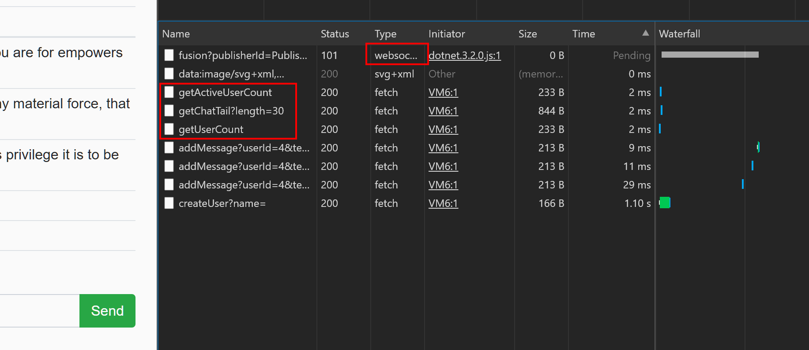
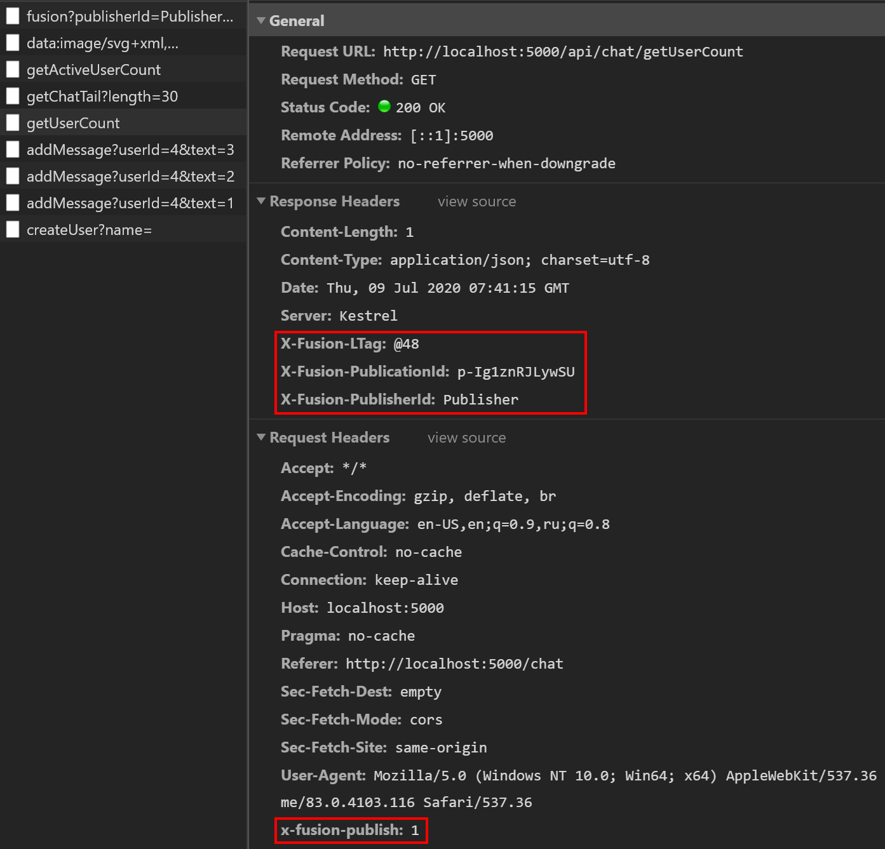
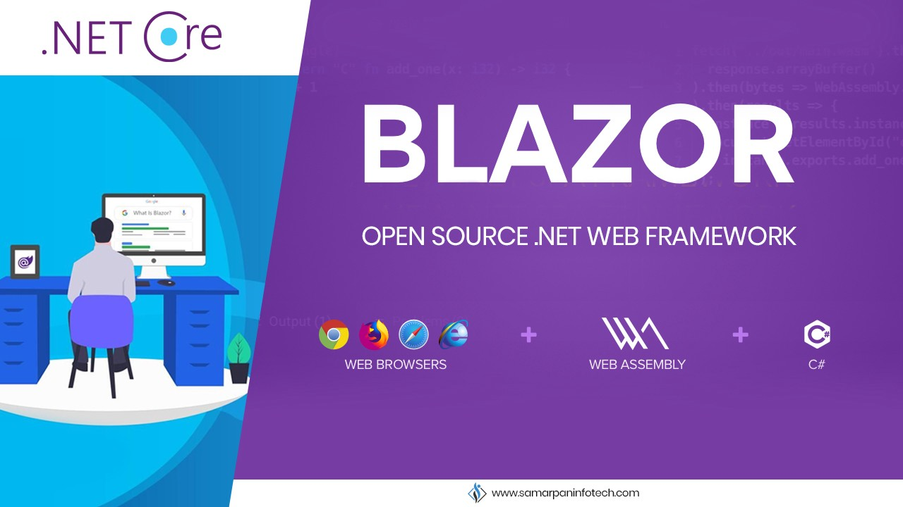

# Stl.Fusion: Introduction  

The intro is fairly long (~ 30 min. to read), but hopefully you'll 
find it interesting.

## The Story Behind Stl.Fusion

TODO: Write the story of how the concept was born.

## What Is Real-time Application?

Ultimately, it's the app displaying always up-to-date content, which 
gets updated even if user doesn't take actions. It's also expected that
"pushes" of such updates are triggered by the changes made by other 
users or services, but not by a timer -- so an app that refreshes the 
page every minute *unconditionally* isn't a fit for this category. 

In more scientific terms, the UI update loop of a regular app
looks as follows:
```cs
// React+Redux - style update loop 
while (true) {
    var action = await GetUserAction();
    (localState, cachedServerState) = 
        await ApplyAction(localState, cachedServerState)
    var uiState = CreateUIState(localState, serverState);
    UpdateUI(uiState);   
}
```  

And this is how a similar loop looks for a real-time app:
```cs
while (true) {
    var localStateChangedTask = localState.ChangedAsync(); 
    var cachedServerStateChangedTask = cachedServerState.ChangedAsync();
    var completedTask = await Task.WhenAny(
        localStateChangedTask,
        cachedServerStateChangedTask);
    if (completedTask == localStateChangedTask)
        localState = await localState.UpdateAsync();
    else
        cachedServerState = await cachedServerState.UpdateAsync();
    var uiState = CreateUIState(localState, cachedServerState);
    UpdateUI(uiState);   
}
```  

As you see, the key part there is `.ChangedAsync()` function,
which is supposed to asynchronously complete once changes happen. 
It's easy to write it for the `localState`, but what about the
`cachedServerState`? It's actually pretty hard, assuming that:
* `cachedServerState` is a small part of "full" server-side state
  that client caches (stores locally)
* We don't want to get too many of false positives - e.g. we don't
  want to send a change notification to every client once any change
  on server happens, because this means our servers will be sending 
  `O(userCount^2)` of such notifications per any interval, i.e.
  it won't scale.

Now let's look at a seemingly different problem: caching with 
real-time entry invalidation driven by changes in the underlying data:

```cs
var observableState = FunctionReturningObservableState();
await cache.SetAsync(key, observableState.Value);
await observableState.ChangedAsync(); // <-- LOOK AT THIS LINE 
await cache.Evict(key);
```  

As you see, it's actually a very similar problem:
you may look at any UI (its state or model) as a value 
cached remotely on the client. 
And if you want to update it in real time, your actually 
want to "invalidate" this value once the data it 
depends on changes &ndash; as quickly as possible. 
The code on the client may react to the invalidation by 
either immediate or delayed update request.

So since both these problems are connected, let's try to
solve them together. But first, let's talk about caching.

## Caching, Invalidation, and Eventual Consistency

Quick recap of what consistency and caching is:

1. **"Consistency"** is the state when the values observed satisfy the
   relation rules defined for them. Relations are defined as
   a set of predicates (or assertions) about the values, but 
   the most common relation is `x == fn(a, b)`, 
   i.e. it says `x` is always an output of some function `fn` 
   applied to `(a, b)`. In other words, it's a **functional relation**.

2. Consistency can be **partial** - e.g. you can say that triplet `(x, a, b)`
   is in consistent state for all the relations defined for it, but
   it's not true for some other values and/or relations. In short,
   "consistency" always implies some scope of it, and this scope can be as
   narrow as a single value or a consistency rule.

3. Consistency can be **eventual** - this is a fancy way of saying that
   if you'll leave the system "untouched" (i.e. won't introduce new changes), 
   *eventually* (i.e. at some point in future) you will find it in 
   a consistent state. 
   
4. **Any non-malfunctioning system is at least eventually consistent**.
   Being worse than eventually consistent is almost exactly the same as 
   "being prone to a failure you won't recover from - *ever*".
   
5. **"Caching"** is just a fancy way of saying "we store the results of 
   computations somewhere and reuse them without running the actual
   computation again". 
   * Typically "caching" implies use of high-performance key-value 
     stores with some built-in invalidation policies (LRU, timer-based 
     expiration, etc.), but...
   * If we define "caching" broadly, even storing the data in CPU
     register is an example of caching. Further I'll be using
     "caching" mostly in this sense, i.e. implying it is a "reuse 
     of previously stored computation results w/o running a computation
     again".
     
Now, let's say we have two systems, A and B, and both are eventually
consistent. Are they equally good for developers? 
No. The biggest differentiating factor between eventually consistent 
systems is the probability of finding them in consistent (or inconsistent) 
state. You can also define this as ~ an expected length of inconsistency 
period for a random transaction that follow the update - in other words,
the duration of a period after a random update during which a random
user of this system might get some data that captures the inconsistency.
* If this period is tiny, such a system is quite similar to 
  always-consistent one. Most of the reads there are consistent, 
  so you as a developer can optimistically ignore the inconsistencies 
  on reads and check for them only when you apply the updates.
* On contrary, large inconsistency periods are quite painful -
  you have to take them into account everywhere, including the
  code that reads the data.

> "Tiny" and "large inconsistency periods" above are a relative
> term &ndash; all you care about is the percent of transactions
> that capture the inconsistency. So if the users of your app 
> are humans, "tiny" is ~ a millisecond or so, but if you build 
> an API for robots (trading, etc.), "tiny" might be a sub-microsecond.

Long story short, we want tiny inconsistency periods. But wait...
If we look at what most caches offer, there are just two ways of
controlling this:
* Setting entry expiration time  
* Evicting the entry manually. 

The first option is easy to code, but has a huge trade-off:
* Tiny expiration time gives you smaller inconsistency periods,
  but simultaneously, it decreases your cache hit rate.
* And on contrary, large expiration time can give you a good cache
  hit ratio, but much longer inconsistency periods might turn
  into a huge pain.


      
So here is the solution plan:
* Assuming we care only about `x == f(...)`-style consistency rules,
  we need something that will tell us when the output of a certain 
  function changes &ndash; as quickly as possible.
* If we have this piece, we can solve both problems:
  * Cache inconsistency
  * Real-time UI updates.
    
## The Implementation

Detecting changes precisely is ~ as expensive as computing the function itself. 
But if we are ok with a small % of false positives, we can assume that
function's output always changes once its input changes. 
It's ~ similar to an assumption every function is a 
[random oracle](https://en.wikipedia.org/wiki/Random_oracle),
or a perfect hash function.

Once we agreed on this, the problem of detecting changes gets much simpler:
we only need to figure out what are all the inputs of every function.
Note that arguments is just one part of the input, another one is anything that's 
"consumed" from external state - e.g. static variables or other functions.

I'll explain how we'll use this convention shortly, but for now let's 
also think of the API we need to get change notifications for
anything we compute.

Let's say this is the "original" function's code we have:
```cs
DateTime GetCurrentTimeWithOffset(TimeSpan offset) {
    var time = GetCurrentTime()
    return time + offset;
}  
```

As you see, this function uses both the argument and the external state
(`GetCurrentTime()`) to produce the output. So first, we want to make it
return something that allows us to get a notification once its output 
is invalidated: 
```cs
IComputed<DateTime> GetCurrentTimeWithOffset(TimeSpan offset) {
    var time = GetCurrentTime()
    return Computed.New(time + offset); // Notice we return a different type now!
}  
```

`IComputed<T>` we return here is defined as follows:
```cs
interface IComputed<T> {
    T Value { get; }
    bool IsConsistent { get; }
    Action Invalidated; // Event, triggered just once on invalidation

    void Invalidate();
}
```

Nice. Now, as you see, this method returns a different (in fact, a new) 
instance of `IComputed<T>` for different arguments, so this part 
of the function's input is always constant relatively to its output.
The only thing that may change the output (for a given set of arguments)
is the output of `GetCurrentTime()`.

But what if we assume this function also supports our API, i.e. it has
the following signature:
```cs
IComputed<DateTime> GetCurrentTime();
``` 

If that's the case, the working version of 
`GetCurrentTimeWithOffset()` could be:
```cs
IComputed<DateTime> GetCurrentTimeWithOffset(TimeSpan offset) {
    var cTime = GetCurrentTime()
    var result = Computed.New(cTime.Value + offset);
    cTime.Invalidated += () => result.Invalidate();
    return result;
}  
```

> If you ever used [Knockout.js](https://knockoutjs.com/) or 
> [MobX](https://mobx.js.org/), this is almost exactly
> the code you write there when you want to create a computed
> observable that uses some other observable &ndash; 
> except the fact you don't have to manually
> subscribe on dependency's invalidation (this happens
> automatically).

As you see, now any output of `GetCurrentTimeWithOffset()`
is automatically invalidated once the output of `GetCurrentTime()`
gets invalidated, so *we fully solved the invalidation problem for
`GetCurrentTimeWithOffset()`!* 

But what's going to invalidate the output of `GetCurrentTime()`?
Actually, there are just two options:
1. Either this function's output is invalidated the same way
   `GetCurrentTimeWithOffset()` output is invalidated - i.e. it similarly 
   subscribes to the invalidation events of all of its dependencies and
   invalidates itself once any of them signals.
2. Or there is some other code that invalidates it "manually".
   This is always the case when one of values it consumes don't support 
   `IComputed<T>`.

Let's ignore functions from the second category for now. Can we
turn every regular function from the first category to a function that
returns IComputed<T> without even changing its code? Yes:
```cs
// The original code in TimeService class
virtual DateTime GetCurrentTimeWithOffset(TimeSpan offset) {
    var time = GetCurrentTime()
    return time + offset;
}

// ...

// The "decorated" version of this function generated in a 
// descendant of TimeService class:                     
override DateTime GetCurrentTimeWithOffset(TimeSpan offset) {
    var result = Computed.New();
    var dependant = Computed.GetCurrent(); // Relies on AsyncLocal<T>
    if (dependant != null)
        result.Invalidated += () => dependant.Invalidate();
    using var _ = Computed.SetCurrent(result); // Relies on AsyncLocal<T>
    try {
        result.SetValue(base.GetCurrentTimeWithOffset(offset));
    }
    catch (Exception e) {
        result.SetError(e);
    }
    return result.Value; // Re-throws an error if SetError was called 
}  
``` 

As you see, the only change I've made to the original was "virtual"
keyword - it allows a proxy type to override this method and implement
the desirable behavior without changing the base!

> For the sake of clarity: the real Fusion proxy code is way more complex -
> due to the fact it:
> * Is fully asynchronous & thread-safe 
> * Hits the cache to pull existing IComputed<T> matching the same set
>   of arguments, if it's available - there is no point to re-compute
>   what's already computed and isn't invalidated yet, right?
> * Implements the logic that makes sure just one computation runs at a time 
>   for a given set of arguments if the value isn't cached - because
>   what's the point to run it concurrently, if the result is expected to
>   be the same?
> * Uses a different invalidation subscription model. The one shown above 
>   isn't GC-friendly: `dependency.Invalidated` handler references a closure
>   that references dependent instance, so while some low-level dependency 
>   is alive (reachable from GC roots), its whole subtree of dependants stays 
>   in heap too, which is obviously quite bad.
> * Has a few other pieces needed for a complete solution to work - e.g.
>   manual invalidation, faster and customizable equality comparison for 
>   method arguments (they have to be compared with what's in cache), 
>   `CancellationToken` handling, ...
>
> But overall, it's a very similar code on conceptual level.

Let's get back to the second part now - the methods that don't call other
methods returning `IComputed<T>` and thus getting no invalidation automatically. 
How do we invalidate them?

Well, we'll have to do this manually. On a positive side, 
think about the logic in a real-life app:
* 80% of it is high-level logic - in particular, anything you have on the 
  client-side and most of the server-side calls something else in the same 
  app to get the data. In particular, most of controller and service layer
  is such a logic.
* Maybe just 20% of logic pulls the data by invoking some third-party code 
  or API (e.g. queries SQL data providers). This is the code that has
  to support manual invalidation.

Shortly you'll learn it's not that hard to cover these 20% of cases. 
But first, let's look at some...

## Real Fusion Code

That's how real Fusion-based code of `GetTimeWithOffsetAsync` looks like:
```cs
public class TimeService : IComputedService
{
    ...

    [ComputedServiceMethod]
    public virtual async Task<DateTime> GetTimeWithOffsetAsync(TimeSpan offset)
    {
        var time = await GetTimeAsync(); // Yes, it supports async calls too
        return time + offset;
    }
}
```

As you see, it's almost exactly the code you saw, but with the following differences:
* The class implements `IComputedService` - a tagging interface with no members. 
  "Computed service" in the content below refers to such types.
* The method is decorated with [ComputedServiceMethod] - the attribute is required
  mainly to enable some safety checks, though it also allows to configure the
  options of computed instances provided for this method.    

In any other sense it works nearly as it was described earlier.

Now let's get back to manual invalidation. The code below is taken from 
`ChatService.cs` in Fusion samples; everything related to `CancellationToken` 
and all `.ConfigureAwait(false)` calls are removed for readability (that's
~ the same boilerplate code as in any other .NET async logic), but the rest 
is untouched.

```cs
// Notice this is a regular method, not a computed service method
public async Task<ChatUser> CreateUserAsync(string name)
{
    // We have to rent or create a new DBContext here, because
    // this service (ChatService) is a singleton in IoC container.
    using var lease = _dbContextPool.Rent();
    var dbContext = lease.Subject;

    // That's the code you'd see normally here
    var userEntry = dbContext.Users.Add(new ChatUser() {
        Name = name
    });
    await dbContext.SaveChangesAsync();
    var user = userEntry.Entity;

    // And that's the extra logic performing invalidations
    Computed.Invalidate(() => GetUserAsync(user.Id));
    Computed.Invalidate(() => GetUserCountAsync());
    return user;
}
```

As you see, it's fairly simple - you use `Computed.Invalidate(...)`
to capture and invalidate the result of another computed service method.

I guess you anticipate there are some cases when it's hard to precisely 
pinpoint what to invalidate. Yes, there are, and here is a bit trickier
example:
```cs
// The code from ChatService.cs from Stl.Samples.Blazor.Server.
[ComputedServiceMethod]
public virtual async Task<ChatPage> GetChatTailAsync(int length)
{
    using var lease = _dbContextPool.Rent();
    var dbContext = lease.Subject;

    // The same code as usual
    var messages = dbContext.Messages.OrderByDescending(m => m.Id).Take(length).ToList();
    messages.Reverse();
    // Notice we fetch users in parallel by calling GetUserAsync(...) 
    // instead of using a single query with left outer join in SQL? 
    // Seems sub-optiomal, right?
    var users = await Task.WhenAll(messages
        .DistinctBy(m => m.UserId)
        .Select(m => GetUserAsync(m.UserId, cancellationToken)));
    var userById = users.ToDictionary(u => u.Id);

    await EveryChatTail(); // <- Notice this line
    return new ChatPage(messages, userById);
}

[ComputedServiceMethod]
protected virtual async Task<Unit> EveryChatTail() => default;

```

> Q: What's the problem here?

A: `GetChatTailAsync(...)` has `length` argument, so let's say we write
`AddMessageAsync` method - how it supposed to find every chat tail
to invalidate, assuming different clients were calling this method
with different `length` values?

> Q: Why fetching users in parallel is ok here?

A: `GetUserAsync()` is also a computed service method, which means its
results are cached. So in a real-life chat app these calls aren't expected
to be resolved via DB - most of these users should be already cached,
which means these calls won't hit the DB and will complete synchronously.

The second reason to call `GetUserAsync()` is to make the resulting 
chat page dependent on all the users listed there. This is the reason 
you instantly see the change of any user name in chat sample: when 
the name changes, it invalidates corresponding `GetUserAsync()` call
result, which in turn invalidates every chat page where this user 
was used. 

> Q: Why do you call  `EveryChatTail()`, which clearly does nothing?

A: This call is made solely to make any chat tail page dependent on it. 
If you look for usages of `EveryChatTail()`, you'll find another one:

```cs
public async Task<ChatMessage> AddMessageAsync(long userId, string text)
{
    using var lease = _dbContextPool.Rent();
    var dbContext = lease.Subject;
    
    // Again, this absolutely usual code
    await GetUserAsync(userId, cancellationToken); // Let's make sure the user exists
    var messageEntry = dbContext.Messages.Add(new ChatMessage() {
        CreatedAt = DateTime.UtcNow,
        UserId = userId,
        Text = text,
    });
    await dbContext.SaveChangesAsync(cancellationToken);
    var message = messageEntry.Entity;

    // And that's the extra invalidation logic:
    Computed.Invalidate(EveryChatTail); // <-- Pay attention to this line
    return message;
}
```

So as you see, we create a dependency on fake data source here &ndash;
`EveryChatTail()`, and invalidate this fake data source to invalidate
every chat tail independently on its length.

You can use the same trick to invalidate data in much more complex
cases &ndash; note that you can introduce parameters to such methods too,
call many of them, make them call themselves recursively with more "broad"
scope, etc.

Ok, now you know that manual invalidation typically requires ~ 1...3
extra lines of code per every method modifying the date, and 0 (typically) 
extra lines of code per every method reading the data. Not a lot, but still,
do you want to pay this price to have a real-time UI? 

Of course the answer is "it depends", but the extra cost clearly doesn't 
look prohibitively high. If you need a real-time UI anyway, or a robust 
caching tier with real-time invalidation, the approach shown here might 
be the best option.

Oh, and there are other benefits. Let's look at another gem:

## Distributed Computed Services

First, notice that nothing prevents us from crafting this "kind" of `IComputed<T>`:
```cs
public class ReplicaComputed<T> : IComputed<T> {
    T Value { get; }
    bool IsConsistent { get; }
    Action Invalidated;
    
    public ReplicaComputed<T>(IComputed<T> source) {
        Value = source.Value;
        IsConsistent = source.IsConsistent;
        source.Invalidated += () => Invalidate();
    } 
}
```

As you see, it does nothing but "replicates" the source's behaviour. Doesn't seem
quite useful, right? But what about remote replicas? What if we implement something
allowing to publish a computed instance on server side, which will let clients
to create its remote replicas listening to invalidation and request its updates?  

Long story short, such type really exists in Fusion, and it works nearly as 
I described. Speaking about the updates - let's add one more useful method 
to our `IComputed<T>`:
```cs
interface IComputed<T> {
    T Value { get; }
    bool IsConsistent { get; }
    Action Invalidated; 
    
    Task<IComputed<T>> UpdateAsync(); // THIS ONE
}
```

`UpdateAsync` allows us to get the most up-to-date `IComputed<T>`
that corresponds to the same computation. If the current `IComputed` is still
consistent, it will simply return itself, otherwise it will trigger the
computation again and produce the new `IComputed<T>` storing its most
current output - or maybe will just fetch it from cache, if it was
already produced by the time we call `UpdateAsync`.

If remote replicas support `UpdateAsync` too, remote clients are free to 
update any *currently inconsistent* value they consume at any time!

Now, can we make it work so that you don't even see the process boundary,
and don't bother about whether you consume a replica or a real computed 
instance? Can we make client-side code to look identical to server-side
code?

As you might guess, YES again!

Fusion provides a fancy base type for your ASP.NET Core API controllers:
`FusionController`. This controller currently provides a single extra method,
and here its complete source code:
```cs
protected virtual Task<T> PublishAsync<T>(Func<CancellationToken, Task<T>> producer)
{
    var cancellationToken = HttpContext.RequestAborted;
    var headers = HttpContext.Request.Headers;
    var mustPublish = headers.TryGetValue(FusionHeaders.RequestPublication, out var _);
    if (!mustPublish)
        return producer.Invoke(cancellationToken);
    return Publisher
        .PublishAsync(producer, cancellationToken)
        .ContinueWith(task => {
            var publication = task.Result;
            HttpContext.Publish(publication);
            return publication.State.Computed.Value;
        }, cancellationToken);
}
```

This is how you use it:
```cs
[Route("api/[controller]")]
[ApiController]
public class TimeController : FusionController, ITimeService
{
    TimeService Time { get; }
 
    ...

    [HttpGet("get")]
    public Task<DateTime> GetTimeAsync() 
        => PublishAsync(ct => Time.GetTimeAsync(ct)); // LOOK AT THIS LINE
}
```

That's all you need to get an `IComputed<T>` created by `Time.GetTimeAsync()`
published!

If you look at `PublishAsync` code above, you'll notice it checks if the
request has `RequestPublication` header (it's actual value is `"X-Fusion-Publish"`),
and:
* If this header presents, it runs a `producer` and does some extra to publish its output
* Otherwise it simply returns the value produced.

All of this means that if you write your controllers like this, you get both a 
"normal" server-side API, and an API that supports Fusion publication mechanism
almost for free!

The proof: if you open Fusion samples and go to http://localhost:5000/swagger/ page,
you'll see this:


You can launch any of these methods right there, of course.

And if you check out what happens on networking tab, here is what you'll see
for Chat sample:



Notice that:
* Every `get*` API method is called just once (for a given set of arguments) - 
  one API call is enough to create a client-side replica of server-side computed
  instance that was created behind the scenes for this call.
* The updates to this replica are coming via WebSocket connection shown first.   
 
And here are the headers of such API requests:


 
You might be curious, how client-side code consuming Fusion API looks like. 
Here is nearly all client-side code (except view) that powers "Server Screen"
sample:

1.  This interface is *literally all you need* to "consume" the 
    API endpoint providing computed replicas behind the scenes!
    Fusion uses [RestEase](https://github.com/canton7/RestEase)
    to generate the actual HTTP client implementing this interface
    in runtime and "wraps" it once more to intercept everything 
    related to its replicas. 
    ```cs
    [Header(FusionHeaders.RequestPublication, "1")]
    public interface ITimeClient : IReplicaService
    {
        [Get("get")]
        Task<DateTime> GetTimeAsync(CancellationToken cancellationToken = default);
    }
    ```

2.  And this is, in fact, an auto-updating client-side model.
    ```cs
    public class ServerTimeState
    {
        public DateTime? Time { get; set; }
    
        public class Updater : ILiveStateUpdater<ServerTimeState>
        {
            protected ITimeClient Client { get; }
    
            public Updater(ITimeClient client) => Client = client;
    
            public virtual async Task<ServerTimeState> UpdateAsync(
                ILiveState<ServerTimeState> liveState, CancellationToken cancellationToken)
            {
                var time = await Client.GetTimeAsync(cancellationToken);
                return new ServerTimeState() { Time = time };
            }
        }
    }
    ```  

The last piece of code doesn't look as nice as everything you saw earlier,
but that's mostly due to the fact client-side models require a  bit of special 
handling - e.g. they shouldn't re-throw exceptions on communication or 
server-side errors. That's why all of them implement `ILiveState` "protocol". 
We'll cover this part later, but for now let's focus on the code inside 
`UpdateAsync`: 
* As you see, it looks like it calls server-side `GetTimeAsync` per every
  update it intends to make (note that `Client` here is of `ITimeClient` type).
* But as you know, `ITimeClient` isn't a usual RestEase client - it's a 
  Fusion-tweaked version of it that supports replicas. So in reality, 
  such services call server-side HTTP endpoint only when the replica 
  corresponding to the arguments isn't already available in cache.
  If a replica is available, but inconsistent, it will be automatically
  updated via WebSocket channel first, but ultimately, the caller 
  will get its most up-to-date version (more precisely, its `.Value`).
* "Cache" above refers to a local cache where all the consisntent instances
  of `IComputed<T>` are registered. It's not exactly the cache - i.e. its 
  actual purpose is a bit different (Tutorial explains this), but for simplicity
  let's call it cache here.

Do `IReplicaService`s differ from `IComputedService`? Yes and no:
* Yes, because they are automatically implemented
* No, because they behave as any other `IComputedService` - in sense that
  you can "consume" the values they produce in other computed services,
  and all the invalidation chains will just work.
  
The "Composition" sample is actually designed to prove this: 
it "composes" its model by two different ways: 
* One model is [composed on the server side](https://github.com/servicetitan/Stl/blob/master/samples/Stl.Samples.Blazor.Server/Services/ServerSideComposerService.cs);
  its replica is published to all the clients
* And another model is [composed completely on the client](https://github.com/servicetitan/Stl/blob/master/samples/Stl.Samples.Blazor.Client/Services/ClientSideComposerService.cs) 
  by combining other server-side replicas.
* **The surprising part:** open two above links side-by-side & spot the difference.

That's why Fusion is a nearly...

## Transparent Abstraction     

Likely, you already spotted that you almost never have to deal 
with `IComputed<T>` directly:
* You never see it as a part of the API
* You never see it in a remote client
* And even the web API based on Fusion looks like a regular one!
* **Nevertheless, it's there and it works!**

In this sense, Fusion is quite similar to Garbage Collection - 
a much more famous transparent abstraction all of us love.


Stay focused, that's the last topic here :)

## Fusion And Other Technologies

### SignalR, Pusher, etc.

Technically, you don't need [SignalR](https://dotnet.microsoft.com/apps/aspnet/signalr) 
or anything similar with Fusion:
* Yes, they are capable to push messages to the clients
* And although Fusion currently "pushes" just one type of message - 
  "the original computed instance for your replica is invalidated", 
  this is more than enough to have the rest, since the subsequent update 
  (or even another API call) can bring all the data needed.

You may think of this as follows:
* Usually the messages we send combine two pieces of information: 
  "the state has changed" + "that's how exactly it changed".
* Fusion is an abstraction designed to track state changes; and although it sends 
  just the first kind of message ("state changed"), getting the actual change once
  you get this notification is a cheap operation, because Fusion also ensures
  everything is computed just once after the change.

Here is an example of API endpoints that could be used to implement messaging:
```cs
Task<int> GetLastMessageIndexAsync(string userId);
Task<Message[]> GetLastMessagesAsync(string userId, int count);
```

Notice that such a solution is even better than something like a server-side
broadcast in SignalR (`Clients.All.*` calls), because if you persist these
messages, they'll be still reliably delivered after a temporary disconnection 
of a client and even a server restart &ndash; Fusion reconnects automatically 
and transparently for replicas, and once this happens, all the client-side 
replicas query its most current state.

Besides that, you don't have to think of concepts like "topics" or 
"subscriptions" - whatever you consume from a client automatically gets
the updates, and if it's something shared amoung multiple clients,
you may thing of this as a "topic".

Of course I don't mean SignalR is completely useless with Fusion - there 
are some scenarios where you could still benefit from it - e.g.
if you really want to deliver the update as quickly as possible, 
SignalR could be a better choice: currently there is no way to tell Fusion
to push the update together with invalidation message, so any update
requires a explicit round-trip after the invalidation. Later
you will learn why this is behaviour is actually quite reasonable,
but nevertheless, there are cases when this could be a deal breaker.

Obvoiusly, we consider addressing this in future.

### Fusion and Blazor = ❤

Why every single piece of a client-side code shown here is supposed to run on 
[Blazor](https://dotnet.microsoft.com/apps/aspnet/web-apps/blazor)? 



Stl.Fusion is just 3 months old project (that's on Jul 9, 2020). 
In human terms she shouldn't even start to crawl yet :) 
And so far it's a one-man creation - more an MVP vs a finished product.
As you might guess, 3 months for all of this + samples, documentation,
and even the first real implementation (yep, we already have one!) 
is a very tight timeline. 

Adding a fully-featured JavaScript client to this "pack" would
expand the timeline by at least 1 month assuming we build it
relying on MobX, i.e. don't even try to replicate the fancy
"Transparent abstraction" concept we have on server.

This is the original reason I ditched the idea of even trying
to implement a JavaScript client and bet on Blazor.

> Though you're welcome to try doing this - and I'll be happy to help!
   
And that's how I learned **Blazor is absolutely amazing!** I am talking
about the client-side Blazor, i.e. its WebAssembly part, though 
I am absolutely sure server-side Blazor isn't any worse,
it just wasn't the right fit for what I tried to accomplish, so
I didn't play with it yet.
   
Let me list a few things about Blazor that impressed me the most:
* Its UI component model is a copycat of React tuned for .NET world.
  If you know React, you'll learn Blazor quite quickly - basically,
  there is 1-1 mapping for almost any concept you know.
* React-style component model is conceptually the best option 
  available for UIs nowadays.
* Blazor is *extremely compatible* with `netstandard2.1` targets.
  For example, I totally didn't expect that a 
  [code like this](https://github.com/servicetitan/Stl.Fusion/blob/master/src/Stl/Async/TaskSource.cs#L89)
  is going to run on Blazor without any modifications. For the sake of
  clarity, it compiles a runtime-generated lambda expression
  that doesn't even pass validation if constructed as usual, 
  because it writes a private readonly field of `TaskCompletionSource`.
* I started to work with it while it was still in preview.
  No bugs or weird issues spotted - neither before the release nor after.
* Yes, the speed isn't on par with .NET Core - not on par at all, because
  currently the MSIL is interpreted there rather than JITted. But:
  * So far it even this level of performance was more than enough for me -
    and this is impressive, taking into account the amount of logic
    running on Fusion client (it's ~ exactly the same logic that is
    running on server, i.e. all these runtime-generated proxies, 
    argument capturing, caching, etc.)
  * The option to switch to server-side Blazor is definitely a
    valuable one. Moreover, you can target both modes with a tiny bit 
    of extra work - isn't this amazing?
  * Finally, 
    [AOT compilation for Blazor is expected with .NET 5](https://visualstudiomagazine.com/articles/2020/05/22/blazor-future.aspx).
  
Besides that, I think Blazor is a very good long-term bet - 
especially for the companies running their server-side code on .NET Core (or .NET).
* WASM is young, and it is improving pretty rapidly - e.g. recently it got threads.
  You won't get threads in JavaScript - ever (workers don't count - they are 
  much more like processes rather than threads). And even this single thing
  can make 20x performance difference in a world where 20+ core CPUs are getting 
  mainstream.
* JavaScript nowadays is more a VM rather than a real language you want to use.
  The real language you use is either TypeScript or one of its brothers designed
  to address all the painful problems of JavaScript. And it becomes more and
  more pointless to compile something to JavaScript assuming you can also
  compile it to WebAssembly. So why do you even want to bet on a tech like
  TypeScript, if the long-term future of a codebase written on it is actually
  under big question? I.e. not that it won't work, but what's the point to delay
  switching to something else assuming its not going to be the best choice in 
  future?      

P.S. If you're reading this, you are absolutely ready
to open [Part 0 of the Tutorial](./Part00.md) or
ask a tricky question on our
[Discord Server](https://discord.gg/EKEwv6d)! 
    
